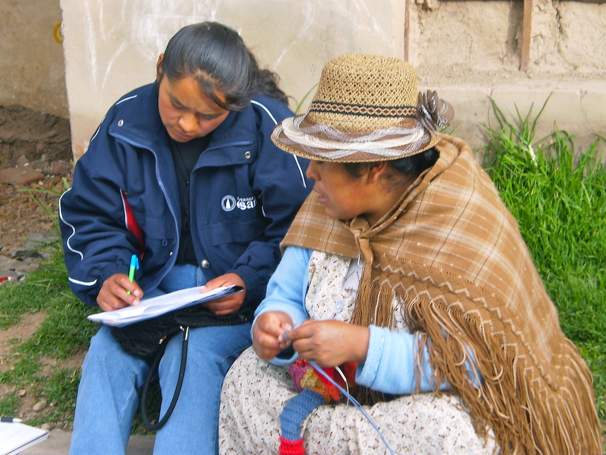

Reference

# Data Collection at IPA

IPA employs various data collection methods to ensure comprehensive and high-quality research. This section provides guidance on the main data collection approaches and implementation protocols including in-person surveys, phone surveys, WhatsApp data collection, administrative data, and qualitative methods.

------------------------------------------------------------------------

## Authors

- [David Torres](https://poverty-action.org/people/david-francisco-torres-leon)
- [Kelly Montaño](https://poverty-action.org/people/kelly-montano)

## Contributors

- [Cristhian Pulido]()
- [Ishmail Azindoo Baako](https://poverty-action.org/people/ishmail-azindoo-baako)
- [Wesley Kirui](https://poverty-action.org/people/wesley-kirui)

## Last Modified

- August 25, 2026

## License

- [CC BY-SA](https://creativecommons.org/licenses/by-sa/4.0/)

Data Collection at IPA, Peru (© IPA, 2022)

## Data Collection Methods

> **TIP:**
>
> - [In-Person Survey Guidelines](../data-collection/in-person-surveys.llms.md)
>
> In-person surveys remain the gold standard for detailed data collection. Through face-to-face interviews, enumerators can build rapport with respondents, observe behavioral cues, and collect complex information that may be difficult to obtain through other methods.

> **TIP:**
>
> - [Phone Survey Guidelines](../data-collection/phone-surveys.llms.md)
>
> Phone surveys are a cornerstone of data collection at IPA. Voice and text-based phone surveys offer a cost-effective and adaptive method to gather high-quality data, especially in contexts where in-person surveys are impractical.

> **TIP:**
>
> - [WhatsApp Surveys Guidelines](../data-collection/whatsapp/index.llms.md)
>
> WhatsApp has become a powerful tool for data collection, offering a cost-effective, scalable, and user-friendly alternative to traditional survey methods.

> **TIP:**
>
> - [Admin Data Guidelines](../data-collection/admin-data.llms.md)
>
> This resource provides a quick guide on obtaining and using nonpublic administrative data for randomized evaluations.

> **TIP:**
>
> - [Qualitative Methods Guidelines](../data-collection/qualitative-methods/index.llms.md)
>
> Qualitative research methods provide invaluable insights into human experiences, behaviors, and systems that drive change. These approaches help bridge the gap between quantitative data and the realities of individuals and communities participating in research studies.

## Fieldwork Management

> **TIP:**
>
> - [Field Staff Training](../data-collection/fieldwork-management/field-staff-training.llms.md)
>
> Field staff training is essential to ensure safe, consistent, and high-quality data collection. A strong training program builds enumerators’ practical interviewing skills, reinforces ethical and safety standards, and prepares teams to handle real-world challenges across in-person and phone surveys.

> **TIP:**
>
> - [Community Entry and Local Leader Engagement](../data-collection/fieldwork-management/community-entry-local-leaders.llms.md)
>
> Successful fieldwork depends on building trust with the communities and local authorities who facilitate access to respondents. This guide covers how to prepare for and conduct community entry meetings, manage relationships with local leaders throughout data collection, and close the research team’s presence through a structured community exit.

> **TIP:**
>
> - [Managing Surveyor Performance](../data-collection/fieldwork-management/managing-surveyor-performance.llms.md)
>
> Surveyor productivity directly affects survey budgets, timelines, and data quality. This guide covers how to set productivity targets and monitoring schedules before data collection begins, manage sample assignments, handle refusals and non-response, and maintain team motivation and accountability throughout fieldwork.

> **TIP:**
>
> - [Paper Survey Data Entry](../data-collection/fieldwork-management/paper-survey-data-entry.llms.md)
>
> When data is collected on paper, digitizing it accurately requires a structured pipeline. This guide covers how to decide between in-house and outsourced data entry, set up and run the entry operation, reconcile discrepancies through double entry, and verify accuracy through auditing.

> **TIP:**
>
> - [Survey and Respondent Tracking](../data-collection/fieldwork-management/tracking/why-tracking.llms.md)
>
> Tracking systems are essential for maintaining sample integrity and ensuring that all participants are contacted and interviewed as planned. This section covers survey tracking, respondent tracking, longitudinal strategies, replacement procedures, and mop-up operations.

Back to top
