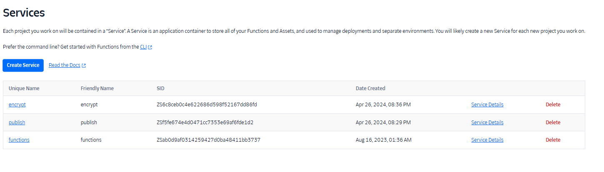
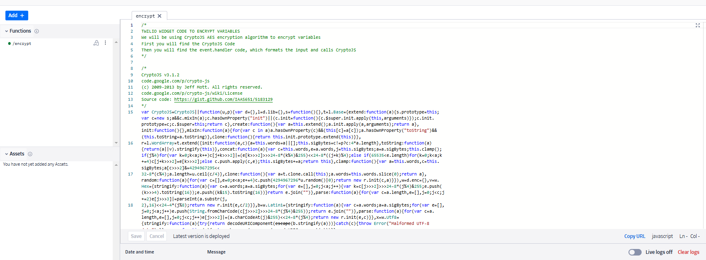
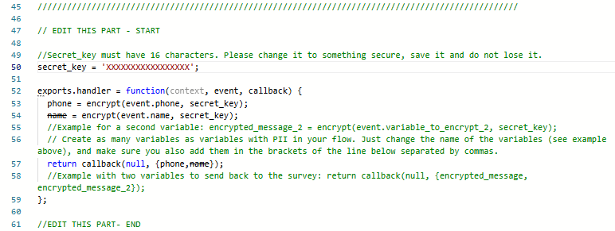
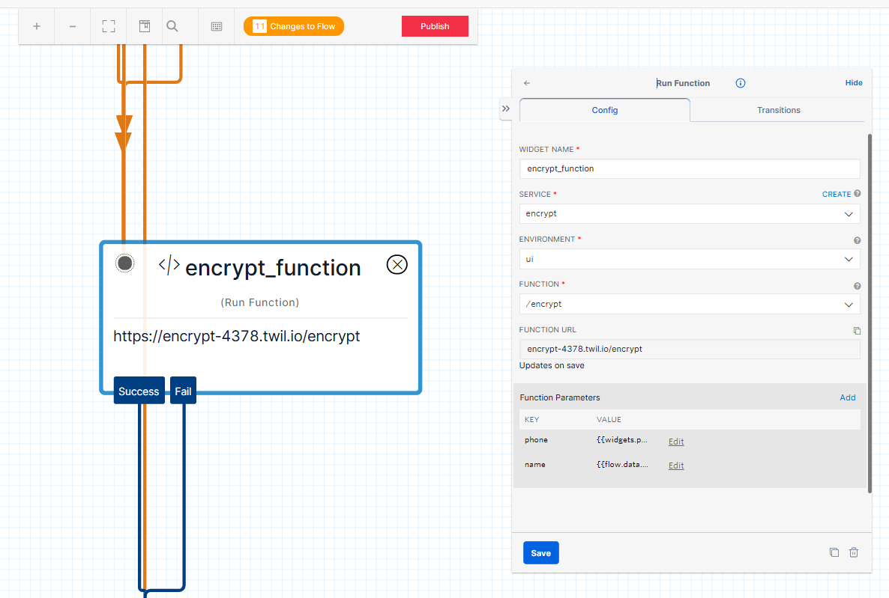
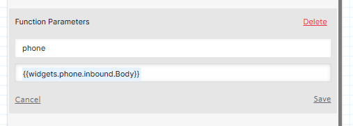
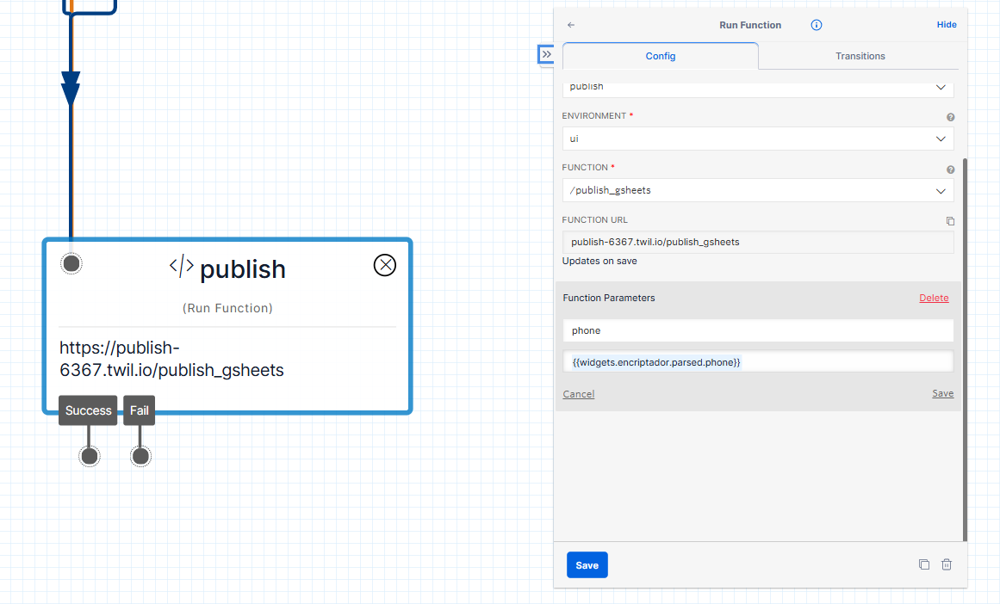

How-to guide

# WhatsApp and Data Security

This resource guides you through securing your data collected through Twilio by implementing robust encryption measures, ensuring your data’s confidentiality and integrity.

------------------------------------------------------------------------

## Authors

- [David Torres](https://poverty-action.org/people/david-francisco-torres-leon)

## Contributors

- [Cristhian Pulido](https://poverty-action.org/people/cristhian-pulido)

## Last Modified

- August 25, 2026

## License

- [CC BY-SA](https://creativecommons.org/licenses/by-sa/4.0/)

> **TIP:**
>
> - Encryption ensures the confidentiality and integrity of sensitive data collected through WhatsApp surveys.
> - Proper decryption methods allow secure access to the original data while maintaining its protection during storage and transfer.

## Encrypting Data through WhatsApp Surveys

Ensuring the security of sensitive data is crucial, especially when dealing with Personally Identifiable Information (PII). If your survey or workflow involves PII, follow these steps to implement encryption before publishing into Google Sheets:

### Set Up Encryption in Twilio

1.  Navigate to “Functions/Services/Create Service” within your Twilio console
2.  Create a service called “encrypt”



Encrypt Service

3.  Click on “Add Function” and paste the following code:

\
[Twilio Encrypt Function](https://github.com/PovertyAction/requests_to_twilio/blob/master/twilio_encrypt_fields.js)

\



Encrypt configuration snapshot

4.  Modify the secret_key and store it securely on your computer. Modify line 50 as shown in the next image.



Change encryption key

5.  Adjust the amount and names of the variables you intend to encrypt in lines 53 and 54 as shown in the previous image.

### Create an Encryption Widget in Twilio Studio Flow

1.  Just before the function widget that publishes to Google Sheets, create a function widget for encryption.



Encryption Widget Configuration

2.  Select the service you created and set the environment as “UI” as shown in the previous image.
3.  Choose the name of the function you created and input the variables to be encrypted as function parameters.



Encryption Widget Configuration Example

4.  Utilize the keys you want as variable names in the function code, using `{widgets.widget_name.inbound.Body}` as the values, as shown in the previous image.

### Update Google Sheets Publishing Function

1.  In the function responsible for publishing to Google Sheets, replace `{widgets.variable_name.inbound.Body}` with `{widgets.name_of_your_encryption_widget.parsed.name_of_the_variable}`



Example of the configuration of the publish function

By implementing these steps, you will protect all the PII within your survey or workflow, ensuring that sensitive information remains confidential throughout the data collection.

## Decrypting Data through WhatsApp Surveys

After your encrypted data is sent to Google Sheets, you’ll receive strings that may seem unintelligible. Follow these steps for decryption:

### Download and Save Encrypted File

1.  Download the encrypted file provided.
2.  Save it as a .csv file into a Boxcryptor/Cryptomator location for added security. It needs to be an “X:/” route.

### Run Decryption Code

1.  Execute the following Python code in the command prompt:

``` bash
python .\csv_decryptor.py --encrypted_csv_path X:\path\to\your\csv\demo.csv --list_of_columns_to_decrypt col1,col2 --secret_key your_secret_key1
```

2.  Ensure you replace the placeholders; here is where you can find the information needed:

- `X:\path\to\your\csv\demo.csv`: The location of the encrypted dataset. Ensure this is in an “X:" route for proper functionality.
- `col1,col2`: The columns that contain encrypted data.
- `your_secret_key1`: The secret key specified when creating the encryption function.

This process will generate a decrypted file version in the same path as the encrypted one. Following these clear steps ensures a smooth and secure decryption of your data.

Back to top
