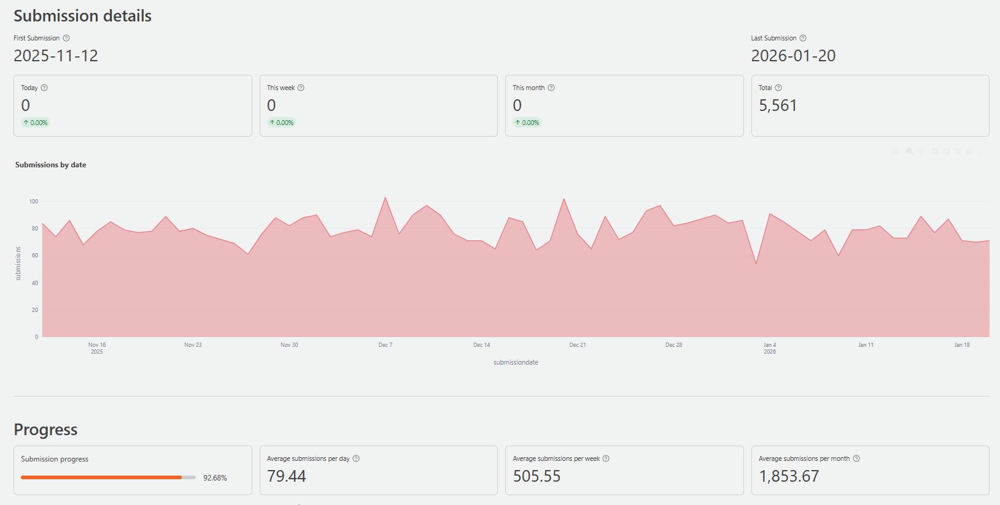
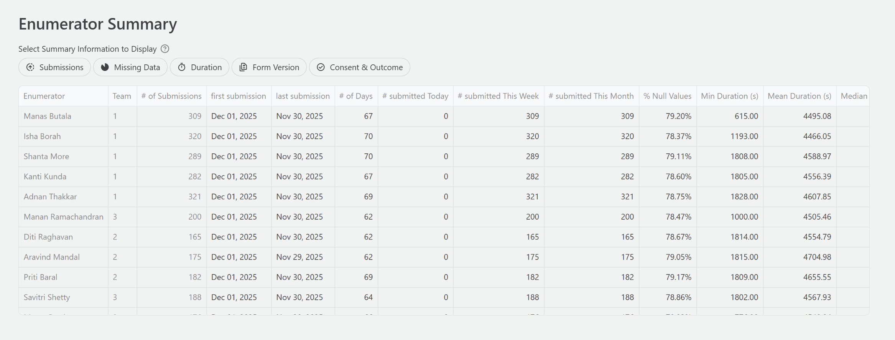
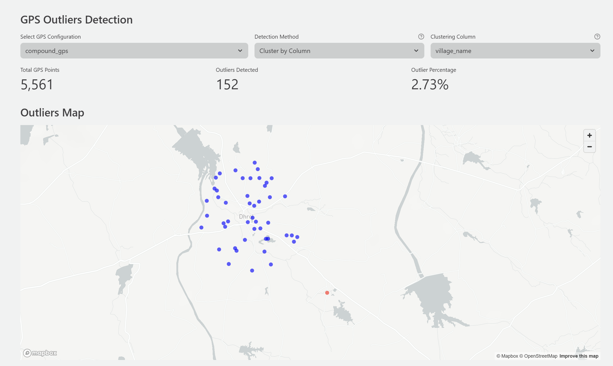

::: {.callout-tip appearance="simple"}
## Key Takeaways

- DataSure is IPA's Data Management System Dashboard, a free tool for monitoring
  survey data quality in real time.
- It automates nine types of data quality checks, including duplicate detection,
  outlier identification, and GPS validation.
- DataSure supports IPA's research protocols for high-frequency checks,
  backchecks, and survey progress tracking.
- It works with data from SurveyCTO and common file formats including CSV,
  Excel, and Stata.
:::

## What is DataSure?

DataSure is IPA's Data Management System (DMS) Dashboard, a free, open-source
application for monitoring and improving survey data quality during field data
collection. Built by IPA's [Global Research and Data Science (GRDS)
team](https://poverty-action.org/research-support), DataSure gives data
managers, survey coordinators, and research teams an interactive dashboard for
reviewing the quality of their survey data as it is collected.

DataSure runs locally on your computer and opens in a web browser. It connects
directly to your SurveyCTO server or accepts uploaded data files in common
formats, automatically runs a comprehensive set of quality checks, and presents
the results in clear, interactive dashboards. When issues are found, DataSure
provides tools to record and track corrections with a full audit trail.

The current version of DataSure is **0.8.0**.

{fig-alt="DataSure Summary dashboard displaying submission trend chart and progress toward target sample size" .lightbox}

## DataSure and IPA's Research Protocols

IPA requires all research projects to follow data quality protocols known as the
[Minimum Must Dos (MMDs)](../index.qmd). These protocols cover data management,
data quality, data security and ethics, and knowledge management.

DataSure directly supports the following MMD requirements:

- **High-frequency checks (HFCs)**: DataSure automates nine types of quality
  checks covering the full scope of what IPA's MMDs require for HFCs. See
  [High-Frequency Checks](../high-frequency-checks.qmd) for more on what HFCs
  are and why they matter.
- **Backchecks**: DataSure's Back Checks module compares survey responses
  against re-interview validation data to identify discrepancies and measure
  enumerator reliability. See [Backchecks](../backchecks.qmd) for background on
  the backcheck protocol.
- **Survey progress tracking**: DataSure tracks submissions in real time,
  reporting daily, weekly, and monthly progress toward your survey target.

DataSure is an alternative to IPA's Stata-based DMS (`ipacheck`), not a
replacement. Teams that already use Stata can continue using `ipacheck`.
DataSure is especially useful for teams that do not use Stata, or that prefer a
visual dashboard interface. See [IPA's Data Management
System](../data-management-system.qmd) for more on the Stata-based DMS.

## What DataSure Checks

DataSure runs nine specialized quality check modules. Each module focuses on a
specific dimension of data quality.

### Summary

Provides a high-level overview of your project, including total submissions,
submission trends over time, and key quality metrics such as duplicate rates,
missing data rates, and backcheck error rates. Use this module to get a quick
picture of how data collection is progressing.

### Survey Progress

Tracks interview completion relative to your target sample size. Shows
submissions by day, week, and month, and monitors consent and completion rates.
Use this module to assess whether collection is on pace and to identify
slowdowns or gaps.

### Duplicates

Finds records that share the same respondent ID or other identifiers that should
be unique, such as phone numbers or household IDs. Reports which columns contain
duplicates and which records are affected. Use this module to catch and
investigate duplicate submissions before they affect your analysis.

### Missing Data

Identifies patterns of incomplete responses across your dataset. Reports missing
values by column, including structured codes such as "Don't Know" or "Refused to
Answer." Shows how missingness changes over time and varies across enumerators.
Use this module to catch systematic data collection problems early.

### Outliers

Flags numeric responses that fall outside expected ranges using statistical
detection methods. You can configure detection thresholds and set known hard
limits for specific variables. Use this module to identify data entry errors,
implausible values, and responses that need follow-up.

### Enumerator Performance

Monitors individual enumerator productivity and data quality. Tracks submission
counts, interview duration, consent rates, completion rates, and response
patterns by enumerator. Use this module to identify enumerators who may need
additional supervision or retraining.

{fig-alt="Enumerator Performance table showing submission activity by enumerator and day, alongside a summary of productivity and quality metrics per field staff member." .lightbox}

### GPS Checks

Validates geographic coordinate data by checking for missing, out-of-range, or
low-accuracy GPS readings. Displays interview locations on an interactive map.
Use this module to verify that surveys are being conducted in the expected
locations.

{fig-alt="Interactive map in the GPS Checks module showing survey interview locations as colored markers, with outlier locations highlighted (in orange) to indicate potential GPS data quality issues." .lightbox}

### Descriptive Statistics

Provides distribution summaries for selected variables, including histograms,
frequency tables, and cross-tabulations. Use this module to review the
composition of your data and detect unusual distributions that may indicate
collection problems.

### Back Checks

Compares responses from re-interview validation visits against the original
survey responses. Reports discrepancy rates by column, enumerator, and
back-checker. Use this module to assess enumerator reliability and identify
systematic errors in data collection.

## Who DataSure is For

DataSure is designed for anyone responsible for managing or reviewing survey
data during field data collection:

- **Data managers** running high-frequency checks for an IPA or other research
  project
- **Survey coordinators** monitoring field team performance and submission
  progress
- **Research teams** that want to review data quality without writing code
- **Organizations** conducting large-scale surveys who need systematic quality
  monitoring tools

DataSure does not require programming knowledge to use. It is designed for users
who are comfortable with spreadsheets and web applications.

## System Requirements

  | Requirement      | Minimum                          | Recommended                 |
  | ---------------- | -------------------------------- | --------------------------- |
  | Operating System | Windows, macOS, or Linux         | Any                         |
  | Python           | 3.11 or higher                   | Latest 3.11+                |
  | RAM              | 4 GB                             | 8 GB                        |
  | Storage          | 1 GB free                        | 2 GB free                   |
  | Browser          | Chrome, Firefox, Safari, or Edge | Chrome or Firefox           |
  | Internet         | Required only for SurveyCTO      | Required only for SurveyCTO |

DataSure runs locally on your computer. No server is required, and no internet
connection is needed for local file analysis.

## Is DataSure Right for Your Project?

DataSure is a good fit for your project if:

- You are conducting a survey-based research project and need to monitor data
  quality during data collection
- Your survey data is in SurveyCTO, CSV, Excel, or Stata format
- You want a visual dashboard for quality checks without writing code
- You need to track enumerator performance and survey progress in real time
- You are running backchecks and want an integrated tool to compare survey and
  re-interview data

DataSure may not be the right fit if:

- You need highly customized or automated checks beyond the nine built-in
  modules

::: {.callout-note title="Get Started with DataSure"}
Ready to install and use DataSure? See the [How to Use
DataSure](how-to-datasure.qmd) guide for step-by-step installation instructions
and a full workflow walkthrough.
:::

::: {.callout-warning title="Need Support?"}
If your project needs help setting up or running DataSure, IPA's Global Research
and Data Science team provides direct technical support. Email
[researchsupport@poverty-action.org](mailto:researchsupport@poverty-action.org).
:::
