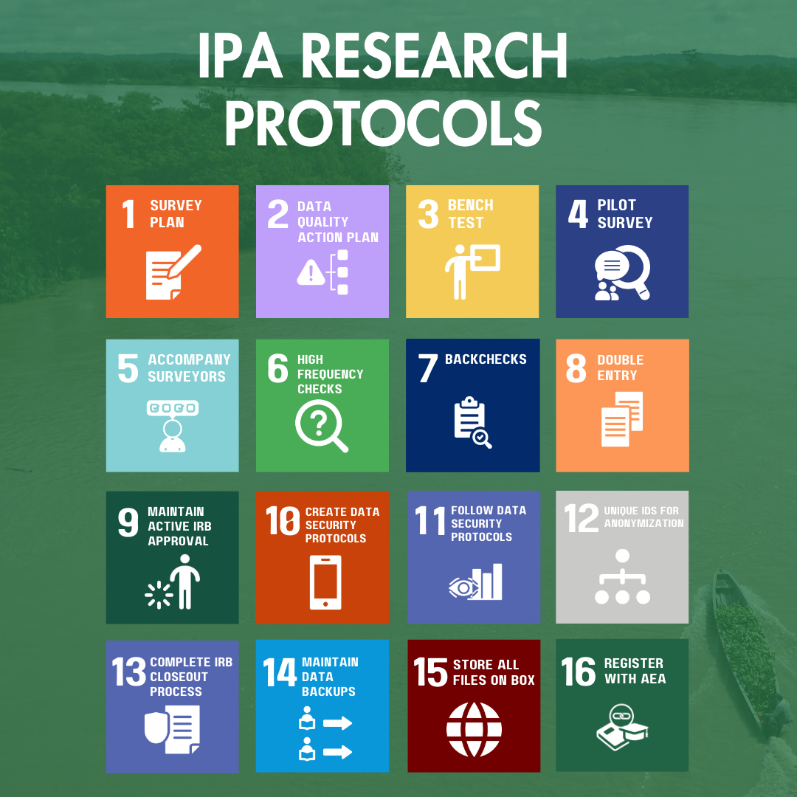

Explanation

# Data Quality

Every research project at IPA is required to follow research protocols, or ‘Minimum Must Dos,’ to ensure that IPA produces high-quality research. These protocols are organized into data management, data quality, data security and ethics, and knowledge management categories.

------------------------------------------------------------------------

## Authors

- [David Torres](https://poverty-action.org/people/david-francisco-torres-leon)

## Contributors

- [Cristhian Pulido](https://poverty-action.org/people/cristhian-pulido)
- [Ishmail Azindoo Baako](https://poverty-action.org/people/ishmail-azindoo-baako)

## Last Modified

- August 25, 2026

## License

- [CC BY-SA](https://creativecommons.org/licenses/by-sa/4.0/)

IPA Research Protocols for High-Quality Research (® David Torres)

## Quality Control

The tasks listed below are essential steps to ensure data quality during surveying and help make sure all your bases are covered in the field. Following these guidelines will help minimize problems in the field and maximize the overall quality of your data and project. These need to be done regardless of whether you hire your own surveyors or hire a survey company. While a survey company may be responsible for some of these steps, it remains IPA staff responsibility to ensure these quality control measures are implemented. If working with an external firm, IPA staff must verify that these tasks are being carried out and maintain oversight of the quality assurance process.

Implementing these data quality steps and taking action if necessary is crucial. This shows the survey team that your top priority is high quality data. Showing surveyors early on that you and survey monitors will be doing these data quality steps will help prevent issues such as falsifying surveys and ensure adherence to proper protocols. These quality control measures can sometimes create tension with survey teams. You can reduce these tensions by explaining to your team that while you trust them, you must also be able to demonstrate to the outside world that you took every step to obtain the highest possible quality of data. Additionally, these quality measures will highlight strengths and areas for improvement among surveyors, enabling the leadership team to provide targeted feedback and training to help them enhance their surveying skills.

### Your Presence in the Field

As a team leader, you should spend time with your surveyors, especially at the beginning of the survey period. This direct presence helps ensure surveyors are conducting surveys correctly, allows you to observe how respondents understand questions, and helps you learn about the community you are collecting data from.

While your presence is important for these key issues, the additional quality control tools outlined on this page—such as high frequency checks, backchecks, and accompaniments will provide you with confidence in the overall quality of data being collected throughout the survey period.

------------------------------------------------------------------------

IPA’s Data Quality Protocols are organized into four main categories. Click on each protocol below to learn more.

> **TIP:**
>
> - [IPA Data Management System (IPA-DMS)](../data-quality/data-management-system.llms.md)
>
> The IPA Data Management System (IPA-DMS) is a fundamental tool that standardizes data quality practices across IPA projects. It provides a structured framework for data cleaning, documentation, and quality control throughout the research lifecycle.

> **TIP:**
>
> - [Survey Plan](../data-quality/survey-plan.llms.md)
> - [Data Quality Action Plan](../data-quality/action-plan.llms.md)
> - [Bench Test](../data-quality/bench-testing.llms.md)
> - [Pilot Survey](../data-quality/pilot-survey.llms.md)
> - [Accompany Surveyors](../data-quality/accompany-surveyors.llms.md)
> - [High Frequency Checks](../data-quality/high-frequency-checks.llms.md)
> - [Backchecks](../data-quality/backchecks.llms.md)
> - [Double Entry](../data-quality/data-integrity.llms.md)

> **TIP:**
>
> - [Maintain active IRB approval](../research-ethics/irb-lifecycle.llms.md)
> - [Data Security Protocol](../data-security/data-security-protocol.llms.md)
> - [How to Implement Data Security Protocols](../data-security/how-to-data-security.llms.md)
> - [Data anonymization](../data-quality/data-anonymization.llms.md)
> - [Complete IRB closeout process](../research-ethics/irb-lifecycle.llms.md)

> **TIP:**
>
> - [Maintain data backups](../data-quality/data-integrity.llms.md)
> - [Store all files on Box](../data-quality/data-integrity.llms.md)
> - [Register with AEA](../data-quality/aea-registry.llms.md)

Back to top
