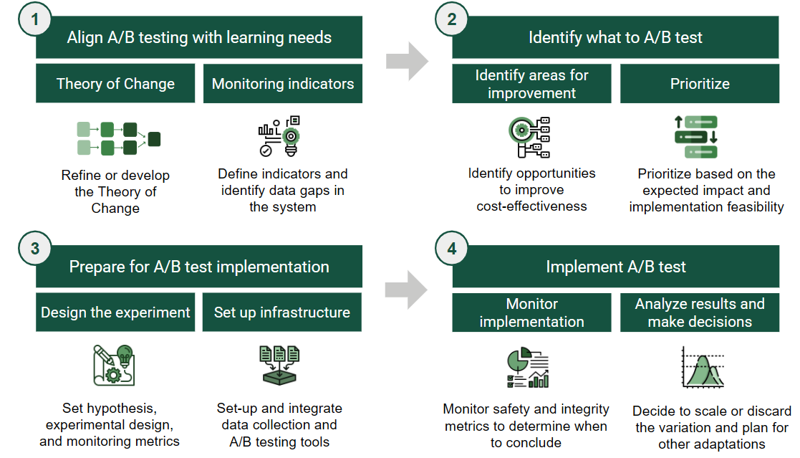
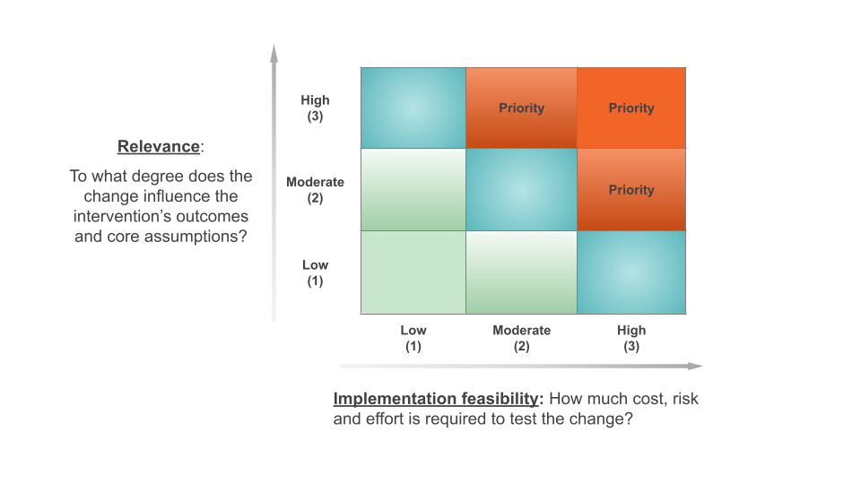

How-to guide

# Implementing A/B Tests

The Learning Roadmap for A/B Testing provides a structured, four-step approach to help organizations design, prioritize, and implement experiments that generate rigorous and actionable insights.

------------------------------------------------------------------------

## Authors

- [Andrés Parrado](https://poverty-action.org/people/andres-parrado)
- [Eduardo Vargas Sanchez](https://poverty-action.org/people/eduardo-vargas-sanchez)
- [Mariana Rodríguez](https://poverty-action.org/people/mariana-rodriguez)

## Contributors

- [David Torres](https://poverty-action.org/people/david-francisco-torres-leon)

## Last Modified

- August 25, 2026

## License

- [CC BY-SA](https://creativecommons.org/licenses/by-sa/4.0/)

> **TIP:**
>
> - The Learning Roadmap consists of four core steps: align, identify, prepare, and implement
> - Anchor testing in your Theory of Change to focus on strategic improvements
> - Use cost-effectiveness as a lens to prioritize what to test

## The Learning Roadmap for A/B Testing

When an organization determines that A/B testing is the right tool to address its intervention’s learning needs, adopting a structured approach becomes key to integrating A/B testing into MEL processes and culture. Successful adoption of A/B testing involves aligning learning goals with experimentation, establishing appropriate infrastructure, and designing processes that generate reliable and actionable insights.

For organizations starting this journey, the challenge is not only how to run a test, but how to build a system that integrates testing as a routine element of decision-making.

The **Learning Roadmap for A/B Testing** offers a structured approach to adopting A/B testing. It helps organizations strategically identify what to test, build necessary capabilities, and conduct experiments that are both rigorous and practical. It ensures that product, technology, and learning activities move in coordination, so that A/B testing becomes a reliable learning tool for informing program and product decisions.

### The Four Core Steps

I. **Aligning A/B testing with learning needs**

2.  **Identifying and prioritizing what to test**

3.  **Preparing for implementation**

4.  **Implementing and learning from the experiment**

In the sections that follow, we describe each step in detail, drawing from our experience supporting organizations that were new to A/B testing but eager to make it a meaningful part of their strategy.

Learning Roadmap for A/B Testing (© IPA)

------------------------------------------------------------------------

## Step 1: Aligning A/B Testing with Learning Needs

A/B testing is most valuable when it is anchored to a clear hypothesis of how an intervention is expected to generate impact. The first step is to revisit the **[Theory of Change (ToC)](../../monitoring-evaluation-learning/theory-of-change.llms.md) to clarify how the product or program is expected to generate meaningful outcomes**[^1].

### Using Your Theory of Change

The ToC helps teams identify:

- The core levers of impact
- The early outcomes that signal the intervention is working
- The parts where there is uncertainty or room for improvement

User journeys or funnels will complement this exercise by capturing granular dynamics within a portion of the ToC, a specific user segment, or a product flow. Therefore, they help identify the areas with the highest potential for A/B testing.

Anchoring experimentation in this structured thinking ensures that testing is used to improve strategic levers of change, not just make superficial tweaks that do not lead to improved outcomes. We suggest using A/B testing to assert early linkages in the ToC, focusing on instances or components of the user journey that are relevant to early and intermediate outcomes.

### Defining Key Metrics

With a clear vision of how the product aims to create impact, grounded on a ToC and possibly a user journey, the next step is to define the metrics that the organization’s data system needs to track to monitor outputs and early outcomes and enable experimentation.

In practice, data available doesn’t have to extend all the way to intermediate or final outcomes (e.g. learning outcomes, changes in pedagogical practices). A/B tests remain valuable when using earlier signals, such as whether students complete a practice quiz, teachers open feedback reports, or users return to the app within a week, to test whether a product or intervention is strengthening early drivers of impact.

Define the most meaningful metrics that reflect signals of positive change towards program cost-effectiveness in terms of reach, meaningful user engagement and experience, and cost. For example, define whether to track the number of “active users” or “recurrent users” as a key indicator of engagement.

Making these distinctions early helps identify critical data gaps and inform what investments may be needed to strengthen the data infrastructure required for effective experimentation. The goal at this stage is to **ensure that the organization can capture key signals of change in a timely and reliable manner**.

------------------------------------------------------------------------

## Step 2: Identifying A/B Testing Priorities Through Cost-Effectiveness

Once a team has developed a solid understanding of their intervention’s Theory of Change and identified which metrics can help assess its validity, they will be better positioned to make strategic decisions about what is worth testing. To focus efforts, teams can use a **cost-effectiveness**[^2] lens to identify the most promising areas for optimization.

### Three Levers for Improvement

Broadly, cost-effectiveness can be improved by:

1.  **Expanding reach**[^3] when the user base is small or uptake is low
2.  **Enhancing efficacy**[^4] when expected changes in early outcomes are not achieved or when key assumptions are not holding
3.  **Increasing efficiency** by reducing costs while achieving the same results

Each lever is linked to specific metrics that guide what to test:

[TABLE]

Identifying A/B Testing Priorities Through a Cost-Effectiveness Framework {.caption-top .table}

### Examples by Lever

**For expanding reach**, this might mean:

- Increasing registration rates
- Improving accessibility and onboarding
- Testing changes such as offering other login options (WhatsApp or email based), setting a referral scheme, or making the landing page more appealing to users

**For enhancing efficacy**, it might involve:

- Increasing meaningful task-related engagement[^5]
- Optimizing changes in knowledge, attitudes, beliefs or short term behaviors
- Enhancing consistent-usage aligned with the ToC
- Testing nudges, changes in content, or impact-related features

**For increasing efficiency**, it may involve:

- Reducing cost-drivers like time of service delivery
- Testing lighter-touch delivery models, streamlining intensive components, or shifting to lower-cost formats, while maintaining the same level of impact per user

### Ideating Variations to Test

Once a priority lever (reach, efficacy, efficiency) and its respective target metric have been selected, product and program teams can lead a light-touch ideation process to identify specific variations to test. These teams, being closest to delivery and user experience, are well positioned to suggest changes that are both feasible and relevant to improve the metric.

While we do not present a detailed brainstorming approach here, even brief, structured conversations can help surface strong ideas for experimentation.

### Prioritizing A/B Testing Opportunities

After identifying several A/B testing opportunities, the next step is to prioritize them using two simple criteria:

1.  **Relevance**: How likely is this variation to improve a key outcome metric? Focus on ideas with the potential to improve results in areas linked to your cost-effectiveness priorities. Use data, prior tests, predictive models, or relevant research to estimate potential impact.

2.  **Feasibility of implementation:** How easy or costly will it be to implement this variation? Consider, with the development team, the costs, effort, and risks of designing and implementing the variation.

For each potential change, rate both relevance and implementation feasibility on a scale from 1 to 3:

- 1 is low relevance / low implementation feasibility
- 2 is moderate relevance / moderate implementation feasibility
- 3 is high relevance / high implementation feasibility

Prioritization criteria

To prioritize, focus first on changes with *high relevance* and *high feasibility* and then consider tests with *moderate* to *high* relevance and feasibility. While these criteria provide a useful framework, additional contextual factors may also influence prioritization decisions.

> **NOTE:**
>
> An organization is considering three A/B testing opportunities that aim to increase platform use. The scoring might look like this:
>
> - **Improving the onboarding process** is expected to have a *high (3)* relevance for increasing platform use and is *moderately (2)* feasible, as it requires investment in developing an improved onboarding experience.
>
> - **Sending email reminders** is expected to have a *low (1)* relevance for increasing platform use and is *highly (3)* feasible because it is low cost and doesn’t require development effort.
>
> - **Gamifying the platform** is expected to have a *high (3)* relevance for increasing platform use and has *low (1)* feasibility because it requires a significant investment and poses some risks to platform performance.
>
> Based on this assessment, *improving the onboarding process* would be prioritized first, as it offers both high relevance with moderate feasibility.

------------------------------------------------------------------------

## Step 3: Preparing for A/B Test Implementation

Careful preparation is essential to running A/B tests that generate clear, actionable insights. This involves first defining the experiment design; then developing a monitoring plan based on the experiment’s success criteria; and finally setting up the necessary technological infrastructure to execute the experiment and collect data as planned.

### Designing the Experiment

A good experiment begins with a **clear learning question** and a **testable hypothesis**. The hypothesis is a well-reasoned guess that articulates how the change being tested might influence an outcome metric.

A good hypothesis would be: *If we send myth-busting messages about the vaccine via WhatsApp (X), the intention to vaccinate (Y) will increase because adolescents’ erroneous beliefs will be corrected (Z).* It clearly states:

- The **change being tested** (e.g., sending myth-busting messages)
- The **outcome you aim to influence** (e.g. intention to vaccinate)
- The **reason why** the change should work (e.g. correcting false beliefs)

Grounding hypotheses in user research, existing data, or prior studies strengthens the validity of the test. In this example, knowing adolescents’ beliefs, trusted information sources, and decision-making patterns helps identify both *what to test* and *why it might work*.

Next, define a **primary outcome metric** that measures whether the change worked and identify how to measure it. Additionally, identify **secondary complementary metrics** that can help explain *why* the change did or did not generate the desired effect.

> **NOTE:**
>
> | **Metric** | **Data source** |
> |----|----|
> | Primary outcome metric: Percentage of adolescents who request an appointment to get vaccinated | Internal appointment system |
> | Secondary metric: Change in the percentage of adolescents who believe that the vaccine generates cancer | Pre and post intervention perception surveys |

Plan the experiment’s statistical requirements[^6] to ensure reliable results. A key factor is sample size which is the number of users (or sessions, depending on the unit of analysis) needed in each group (A and B) to be able to reliably detect an effect if one exists. If the sample size is too small the test might fail to detect a real effect, leading to the wrong conclusion that the change didn’t work when in fact the treatment was beneficial.

Finally, plan the operational details of the experiment:

- Define *when* and *how* to assign users to the experiment. There are two possibilities: predefined assignment or assignment on a rolling basis.
- Define when the experiment will start and how long it will run, accounting for the implementation context and the expected time required to observe changes in the target outcome. It’s important to run tests long enough to avoid misleading results.

With a well-designed experiment in place, the next step is to design the variation.

### Designing and Developing the Variation

When designing test variations, such as the content of the myth-busting messages, draw on evidence and user insights to inform design choices. Also, plan for the budget to develop and implement the variation, keeping in mind that more complex changes may require greater investment. Before launching, validate that the variation works as intended and is understandable to implementation teams (if relevant).

> **TIP:**
>
> - Gathering user input to inform design
> - Review evidence of what has worked in similar interventions
> - Reviewing past behavior data related to the target metric
> - Testing variation functionality and observing user experience with it
> - Refining hypotheses based on this feedback

### Definition of Monitoring Metrics

Once the experiment design is clear, define the metrics you will monitor during implementation and later use for decision-making:

**System and product safety metrics** are used to check whether an experiment is unintentionally harming the user experience or platform performance. Monitoring these metrics helps detect potential issues early. For example, if during an experiment you see a sharp rise in the percentage of users starting but not completing a curriculum, this might indicate that the new content is disengaging or confusing users. In such cases, the team can pause or stop the experiment to avoid further harm.

**Research integrity metrics** assess how reliable the results of the experiment are. They help check both whether the test groups are comparable and whether the intervention was delivered as intended. These metrics typically fall into three categories:

- **Assignment integrity** checks whether users were correctly randomized and assigned to groups as planned. For example, if you planned a 50-50 split, in a sample of 500 users about 250 should be assigned to each group. If one group is much bigger than the other, it is likely that both groups are not comparable.

- **Group comparability** checks whether the groups have a similar mix of key characteristics that could affect outcomes. For example, if gender might affect the outcome, both groups should have about the same number of females and males.

- **Implementation fidelity** checks how closely the experiment was delivered as intended. For example, whether the correct variation (features or content) was shown to the right users.

**Results metrics**, which you will have defined when designing the experiment, are used to evaluate the impact of the change. The primary metric shows whether the change worked, while secondary metrics help explain why it worked (or why it didn’t).

Once you’ve defined the metrics, design the structure of the experiment microdata. Define what each row should represent (the unit of analysis) and which variables go in each column to support metric calculations and analysis. This ensures that all required data is captured at the appropriate unit of analysis (typically user level or session level), enabling robust analysis and visualization of the results.

### Setting up the Technological Infrastructure

Establishing a robust A/B testing system requires first selecting and then setting-up tools and systems to **manage experimentation**, **collect data accurately**, **monitor tests**, and **analyze results**[^7]. There are various options available, ranging from open-source tools where you can find non-profit specific solutions such as [Evidential](https://docs.evidential.dev/) and [UpGrade](https://www.upgradeplatform.org/), proprietary tools, to developing the system in house.

Setting up technological infrastructure is part of a long-term investment, so aligning with the organization’s specific needs and technical capacity is key to ensure long-term use and adoption of the A/B testing system.

When **selecting technological tools and systems** consider the following:

- **Compatibility:** Choose solutions that integrate seamlessly with the organization’s existing technological infrastructure.
- **Cost:** Account for licensing fees, implementation costs, hosting[^8], and support expenses. Remember that there are open-software options available that are often free.
- **Feature Requirements:** Define the organization’s essential “must-have” vs. optional “nice-to-have” features. Key functionalities to assess include basic experiment setup, testing methodologies, targeting and stratification, and analysis and reporting.

Once you’ve chosen all the tools and systems for your infrastructure, set and integrate them. Configure a dashboard with visualizations for the monitoring metrics previously defined. Then, before launching the experiment, make a mock test to validate that the experimentation system is working correctly and that the “pipelines” between tools are well integrated. Faults in the system systems can lead to misleading results and false conclusions.

> **TIP:**
>
> Before launching a real A/B test, **run a mock test (known as A/A test)** to validate that the system and its pipelines are working correctly. In this test, users are randomly split into two groups receiving the same version of the intervention, which in essence is not testing anything. Verify the following:
>
> - **Check** that the **system is collecting all the necessary data** to monitor the experiment.
>
> - **Compare the metrics collected** against trusted sources, such as server logs or known historical data. Any discrepancies such as misaligned timestamps, missing values, or inconsistent values should be resolved before an experiment goes live.
>
> - **Check for proper random assignment**, where the distribution of users between the two groups is split according to the initial experimental design, for example 50% of the sample of users go to one group and 50% to the other.
>
> - **Check for important differences between the groups across key variables**, such as a group with a larger portion of users with access to a computer at home. In theory, there shouldn’t be an actual difference between the groups, so any differences observed may indicate flawed randomization, inaccurate data collection, or hidden bugs.

------------------------------------------------------------------------

## Step 4: Implementing A/B Tests

Once your A/B test is live, it is important to monitor it carefully to verify that it is working correctly. When the experiment has concluded, analyze and interpret the results in a way that supports sound decision-making.

### Monitoring Key Metrics

During the test, regularly monitor the execution and some key metrics, defined in your experiment plan. This ensures that the test is running correctly and that the results will be reliable.

- **Verify that the microdata** is being collected and stored securely and completely.
- **Continuously monitor safety metrics** throughout the experiment to quickly detect and address any negative impacts on user experience or system performance. If the problem can’t be fixed, consider stopping the experiment.
- **Monitor the number of users participating in the experiment**. If the sample is smaller than expected, consider actions to increase reach, such as sending reminder messages inviting users to participate in the intervention or allowing the experiment to run for a few more weeks than originally planned.
- **Check integrity metrics** at least two weeks into the experiment, to verify random assignment and comparability between groups, as well as implementation fidelity.
- Analyze **results metrics** after allowing sufficient time for data stabilization. This helps avoid drawing conclusions too early or mistaking short-term patterns for real effects.

Timely and careful monitoring supports accurate interpretations and enables informed decision-making.

### Analyzing and Interpreting Results for Decision-Making

Once the experiment has run for the predetermined period, gather the relevant team members to analyze the results. A structured analysis process should guide the discussion and decision-making. This process involves three key steps:

#### 1. Assess the credibility of the experiment

Begin by reviewing the integrity metrics to evaluate whether the results are trustworthy. First, check if the sample size is large enough to detect a meaningful effect based on your power calculations. Then, check whether the groups are statistically comparable on key characteristics. Based on the sample size and balance between the samples, discuss the level of confidence you have in the validity and reliability of the results.

#### 2. Assess the effectiveness of the variation

Examine the outcome metric to determine the impact of the tested variation. What do the data suggest about the effect of the change? Is there a clear difference in performance between groups? Try to identify a plausible mechanism that could explain how the variation produced the observed result.

#### 3. Interpret the data and make a decision

Based on the evidence, decide whether to extend or conclude the experiment. You may decide to extend the experiment to reach a larger sample size. If concluding, confirm or reject the hypothesis based on the data and decide:

- **If results are inconclusive or null**, consider repeating the experiment if you suspect issues with the design, implementation, or measurement that may have affected the outcome. Otherwise, you may choose to discard the variation and move on to the next experiment.

- **If the results show a positive effect** on the results metric, you can scale the variation to all users or relevant segments, or continue testing to find an even more effective variation.

- **If the results show a negative effect** on the results metric, discard the variation and use the findings to inform future iterations.

Make sure to use findings from the A/B test to make adaptations to the product or intervention. It is not only about scaling or discarding the variation, but understanding in depth why something worked better (or not) and using those insights to make other adaptations and decisions, test other things, and even share learnings with the broader development community.

> **NOTE:**
>
> An education platform is testing whether adding personalized feedback increases student engagement. After three weeks they analyze results:
>
> - Safety metrics have shown that system performance remains stable, with no increase in load time or crash rate.
>
> - Integrity checks confirm that the test has been implemented as planned, and both groups are balanced by grade level and prior average engagement time.
>
> - The sample size is sufficient to detect a 5% change in the primary outcome metric (time spent in the platform).
>
> - The results metrics suggest a 6% increase in engagement in the group that received personalized feedback compared to the control group, with additional evidence from user click data showing that students are actively reading the feedback.
>
> Based on these findings, the team may decide to conclude the experiment and scale the change across all users. However, if the sample size had been too small or the groups had been unbalanced, they might extend the test before making a final decision.
>
> Given the significant effect of personalized feedback on user engagement, the organization decides to test whether video or text feedback is more effective in helping students answer the next set of questions correctly.

Finally, allocate time to reflect on the full process. Document key challenges, unexpected findings, and lessons learned during the design and implementation phases. Use these insights to plan improvements for the next cycle of experimentation. This reflective practice is essential to strengthen your organization’s A/B testing capabilities and ensure continuous learning.

Implementing A/B testing is not about getting everything perfect from the start. It is about building a process that allows your team to test, learn, and adapt over time. The Learning Roadmap provides a structure to guide this process, helping organizations strengthen their capabilities step by step. The next section offers additional practical guidance drawn from early experiences supporting organizations in adopting A/B testing.

## References

Abdul Latif Jameel Poverty Action Lab. (n.d.). *Quick guide to power calculations*. https://www.povertyactionlab.org/resource/quick-guide-power-calculations

Kohavi, R., Tang, D., & Xu, Y. (2020). *Trustworthy online controlled experiments: A practical guide to A/B testing*. Cambridge University Press.

Kohavi, R., Deng, A., & Vermeer, L. (2022). A/B testing intuition busters: Common misunderstandings in online controlled experiments. In *Proceedings of the 28th ACM SIGKDD Conference on Knowledge Discovery and Data Mining (KDD ’22)* (pp. 3168–3177). Association for Computing Machinery. https://doi.org/10.1145/3534678.3539160

Back to top

[^1]: A theory of change is a structured, logical representation of how an intervention is expected to create impact. It highlights the activities and outputs that generate the hypothesized sequence of outcomes that lead to long-term goals, with early outcomes serving as key signals that the intervention is on the right path.

[^2]: Cost-effectiveness measures how efficiently an intervention converts resources into meaningful impact by considering the number of people reached and the depth of change achieved on a specific outcome.

[^3]: The extent to which an intervention is accessible to its target population.

[^4]: How well is the intervention addressing users’ needs? Refers to the depth or magnitude of the positive change achieved per user.

[^5]: There is still mixed evidence about the correlation between engagement and learning outcomes, but it is clear that the impact of educational programs on student learning is contingent upon the quality and fidelity of their implementation (Vanacore et al., 2023). Additionally, high-quality engagement, such as thoughtful completion of assessments, effective use of hints, and meaningful interactions with platform content, has proven to be a stronger predictor of gains in learning outcomes than simply measuring time spent or the number of interactions (Ruipérez-Valiente et al., 2018; Muñoz-Merino et al., 2013; Kelly et al., 2013).

[^6]: Review power calculations for the experiment. You can use [J-PAL’s Quick Guide to Power Calculations](https://www.povertyactionlab.org/resource/quick-guide-power-calculations) and [Sample and Power Calculations](../../research-design/sample-size-power.llms.md).

[^7]: Setting up the technological infrastructure for A/B testing can run in parallel with steps one and two as data and infrastructure gaps emerge.

[^8]: Hosting refers to where the data and system will be stored.
