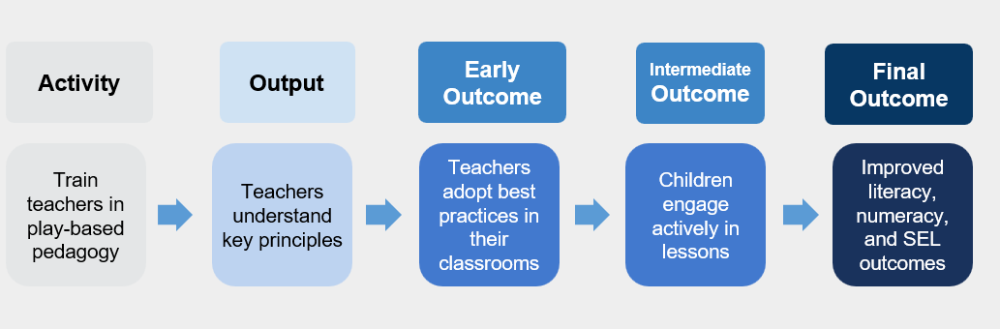

Explanation

# Theory of Change

How to develop a robust Theory of Change, linking program activities to outcomes through evidence-based pathways.

------------------------------------------------------------------------

## Authors

- [Manuel Bustamante](https://poverty-action.org/people/manuel-bustamante)
- [Mariana Rodriguez](https://poverty-action.org/people/mariana-rodriguez)
- [Camila Muñoz Medina](https://poverty-action.org/people/camila-munoz-medina)
- [Simon Rubio](https://poverty-action.org/people/simon-rubio)
- [Alejandro Mojica Godoy](https://poverty-action.org/people/alejandro-mojica-godoy)

## Contributors

- [David Torres](https://poverty-action.org/people/david-francisco-torres-leon)

## Last Modified

- September 4, 2026

## License

- [CC BY-SA](https://creativecommons.org/licenses/by-sa/4.0/)

IPA field team conducting surveys in Uganda (© IPA)

> **TIP:**
>
> - A **Theory of Change** maps how program activities lead to intended outcomes through clear, logical pathways
> - Strong ToCs must be **active** (specific actions), **clear** (distinct components), **logical** (causal relationships), and **detailed** (sufficient for M&E)
> - Every ToC pathway relies on **explicit assumptions** and **risks** that need monitoring and validation

## What is a Theory of Change?

A Theory of Change (ToC) is a comprehensive description and illustration of how and why a desired change is expected to happen in a particular context. It maps out the logical sequence from activities to outputs to outcomes to impact, making explicit the assumptions underlying each link in the causal chain.

### Visual vs. Narrative Representation

> **TIP:**
>
> A ToC can be presented as:
>
> - **Visual diagram**: Shows the causal pathways through boxes and arrows
> - **Narrative description**: Written explanation of the change process
> - **Combination**: Visual diagram with accompanying narrative (most effective)
>
> The visual representation helps stakeholders quickly grasp the overall logic, while the narrative provides essential detail about mechanisms and assumptions.

### Purpose and Benefits

> **TIP:**
>
> **Communication**: Provides a clear, concise way to explain your program to stakeholders
>
> **Alignment**: Creates shared understanding among team members about goals and strategies
>
> **Learning Framework**: Identifies what to monitor and evaluate at each stage
>
> **Adaptation**: Highlights assumptions to test and refine through implementation

## Components of a Theory of Change

A comprehensive ToC consists of five key components that form a logical chain from implementation to impact.

### The Five Essential Components

> **TIP:**
>
> **Definition**: The specific actions your organization implements
>
> **Characteristics**:
>
> - Use active verbs (train, provide, deliver, organize)
> - Specify who does what
> - Exclude internal processes (e.g., planning, procurement)
>
> **Example**: “Deliver 10 business skills training sessions to caregivers” NOT “Support caregivers”

> **TIP:**
>
> **Definition**: The direct products of activities
>
> **Characteristics**:
>
> - Immediately measurable
> - Under direct control of the program
> - One output per activity
>
> **Example**: “Caregivers attend and complete 10 training sessions”

> **TIP:**
>
> **Definition**: Short-term changes in participants
>
> **Types of changes**:
>
> - Knowledge
> - Attitudes
> - Beliefs
> - Behaviors (sometimes)
>
> **Measurement**: During or immediately after implementation **Attribution**: Directly attributable to program activities

> **TIP:**
>
> **Definition**: Medium to long-term changes resulting from initial outcomes
>
> **Characteristics**:
>
> - May be influenced by external factors
> - Require initial outcomes to be achieved first
> - Need experimental methods to measure causality
>
> **Example**: “Caregivers apply business skills to increase income”

> **TIP:**
>
> **Definition**: Long-term goals of the program
>
> **Characteristics**:
>
> - Ultimate changes in beneficiaries’ lives
> - Influenced by multiple factors beyond the program
> - Require rigorous evaluation to establish attribution
>
> **Example**: “Improved economic stability and wellbeing of families”

### Visual Representation

Theory of Change Components Diagram

## Characteristics of a Strong Theory of Change

### The Four Essential Qualities

> **TIP:**
>
> **Activities use specific action verbs**:
>
> - ✅ Good: “Train 20 facilitators in child development”
> - ❌ Weak: “Support child development”
>
> **Focus on what the organization does**, not internal processes

> **TIP:**
>
> **Each component is distinct and specific**:
>
> - Same level of detail across components
> - One output per activity
> - No overlapping elements
>
> **All aspects of the program are represented**

> **TIP:**
>
> **Arrows represent causal relationships, not chronology**:
>
> - Each link shows how one element causes the next
> - The pathway makes sense conceptually
> - No logical leaps or missing steps
>
> **Example**:
>
> - Logical: Training → Increased knowledge → Applied skills → Higher income
> - Not logical: Training → Higher income (missing intermediate steps)

> **TIP:**
>
> **Sufficient detail for monitoring and evaluation**:
>
> - Distinguishes between initial and intermediate outcomes
> - Includes all necessary steps in the causal chain
> - Specific enough to guide measurement
>
> **Helps identify**:
>
> - What outputs to monitor during implementation
> - Which outcomes to measure at different stages
> - When to conduct evaluations

## Assumptions and Risks

Every arrow in a Theory of Change represents assumptions about how change happens. Making these explicit is crucial for learning and adaptation.

### Understanding Assumptions

> **TIP:**
>
> **Definition**: Conditions that must hold true for the causal pathway to work
>
> **Examples**:
>
> - Participants will attend sessions if scheduled conveniently
> - New knowledge will be retained and applied
> - Market conditions will remain stable enough for businesses to grow
>
> **Why they matter**: Unmet assumptions can break the causal chain

### Identifying and Managing Risks

> **TIP:**
>
> **Risk**: A specific threat to an assumption being met
>
> **Examples of improving risk specification**:
>
> | Weak Risk Statement | Strong Risk Statement |
> |:---|:---|
> | “Low attendance” | “Work schedules prevent 40% of participants from attending morning sessions” |
> | “Content not relevant” | “60% of business curriculum doesn’t match local market conditions” |
> | “No behavior change” | “Social norms discourage women from starting businesses independently” |

### Prioritizing Risks

> **TIP:**
>
> Focus learning efforts on risks that are both:
>
> 1.  **Important**: Would significantly impact success if they occur
> 2.  **Uncertain**: Limited evidence about likelihood or mitigation strategies
>
> **Priority quadrants**:
>
> - High importance + High uncertainty = **Priority for testing**
> - High importance + Low uncertainty = **Standard mitigation**
> - Low importance + High uncertainty = **Monitor only**
> - Low importance + Low uncertainty = **Acknowledge but don’t focus**

## Learning Approaches

Different methods help test assumptions and understand risks at various stages of implementation.

> **TIP:**
>
> - **When to use**: Before full implementation
> - **Purpose**: Test feasibility and refine approach
> - **Methods**: Small-scale implementation with intensive monitoring
> - **Example**: Test training curriculum with 2-3 groups before scaling

> **TIP:**
>
> - **When to use**: Any stage, especially for understanding “why”
> - **Purpose**: Explore perceptions, motivations, and barriers
> - **Methods**: Facilitated group discussions
> - **Example**: Understand why attendance is lower than expected

> **TIP:**
>
> - **When to use**: During implementation
> - **Purpose**: Track outputs and early outcomes
> - **Methods**: Analyze program records and monitoring data
> - **Example**: Review attendance records to identify patterns

> **TIP:**
>
> - **When to use**: Design phase or when facing specific challenges
> - **Purpose**: Leverage specialized knowledge
> - **Methods**: Interviews or advisory meetings
> - **Example**: Consult labor economists about local market conditions

## Using Theory of Change for Monitoring and Evaluation

### Monitoring Focus

> **TIP:**
>
> **Outputs and Initial Outcomes** are the focus of monitoring because:
>
> - They’re under program control
> - Directly attributable to activities
> - Provide real-time feedback for improvement
>
> **Key indicators**:
>
> - Participation rates
> - Completion rates
> - Quality measures
> - Immediate knowledge/attitude changes

### Evaluation Focus

> **TIP:**
>
> **Intermediate and Final Outcomes** require evaluation because:
>
> - External factors may influence them
> - Attribution needs to be established
> - Longer time horizons are involved
>
> **Methods**:
>
> - Experimental designs (RCTs)
> - Quasi-experimental approaches
> - Mixed methods to understand mechanisms

## IPA’s Right-Fit Evidence Approach

IPA’s **Right-Fit Evidence (RFE)** team has developed practical tools and frameworks for creating and using Theories of Change effectively.

### Key Principles

> **TIP:**
>
> **Match methods to learning needs**:
>
> - Not every question needs an RCT
> - Start with the decision you need to make
> - Use the most efficient method that provides sufficient confidence
>
> **Iterative learning**:
>
> - Test assumptions progressively
> - Adapt based on evidence
> - Document changes and rationale

### Resources and Support

> **TIP:**
>
> **Templates and Tools**:
>
> - ToC development worksheets
> - Assumption mapping guides
> - Risk prioritization matrices
>
> **Capacity Building**:
>
> - Workshops on ToC development
> - Peer review processes
> - Community of practice
>
> **Technical Assistance**:
>
> - Direct support for complex programs
> - Review and feedback services
> - Connection to subject matter experts

## Common Pitfalls and How to Avoid Them

> **WARNING:**
>
> **Problem**: Using general terms like “improve wellbeing” or “strengthen capacity” **Solution**: Be specific about what will change and how you’ll measure it

> **WARNING:**
>
> **Problem**: Jumping from training to long-term impact without intermediate steps **Solution**: Think through each necessary change in the causal chain

> **WARNING:**
>
> **Problem**: Including every possible pathway and outcome **Solution**: Focus on the main causal pathways; document others separately

> **WARNING:**
>
> **Problem**: Creating a ToC once and never updating it **Solution**: Review and revise based on learning; document changes

## Additional Resources

- [IPA’s Right-Fit Evidence Resources](https://www.poverty-action.org/right-fit-evidence)
- [Theory of Change Guidance - UNICEF](https://www.unicef-irc.org/publications/pdf/Brief%202%20Theory%20of%20Change_ENG.pdf)
- [DIY Toolkit: Theory of Change](https://diy-toolkit.org/tools/theory-of-change/)

Back to top
