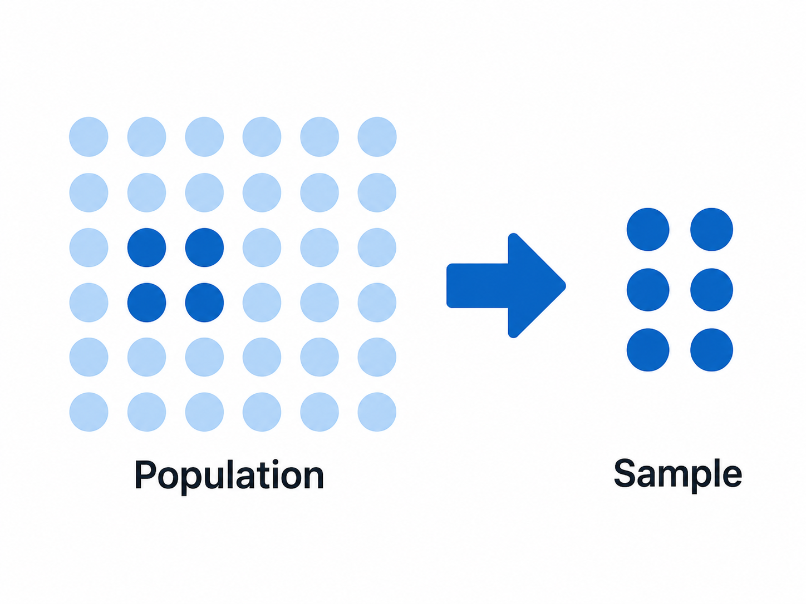
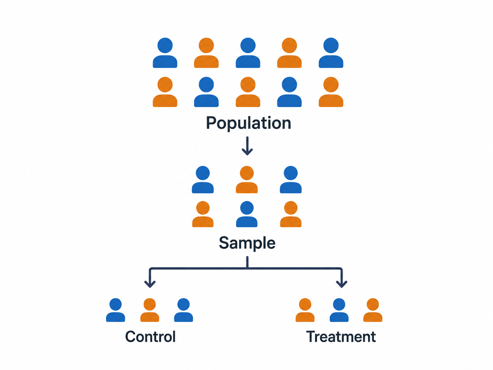

Explanation

# Randomization

Introduction to randomization in impact evaluations, covering theoretical foundations and practical implementation strategies for researchers.

------------------------------------------------------------------------

## Authors

- [Rosemarie Sandino]()
- [David Torres](https://poverty-action.org/people/david-francisco-torres-leon)

## Contributors

- [Kelly Montaño](https://poverty-action.org/people/kelly-montano)
- [Radhika Jain]()
- [Devika Lakhote]()
- [Laura Feeney]()

## Last Modified

- August 25, 2026

## License

- [CC BY-SA](https://creativecommons.org/licenses/by-sa/4.0/)

> **TIP:**
>
> - **Randomization** creates comparable treatment and control groups by ensuring each unit has an equal chance of assignment
> - **Unit of randomization** (individual vs. cluster) affects statistical power, spillovers, and implementation feasibility
> - **Different randomization methods** address specific evaluation contexts and program constraints
> - **Implementation challenges** such as noncompliance and spillovers require planned responses that begin at the design stage

## What is Randomization?

Randomization is the cornerstone of rigorous impact evaluation. This process assigns units, such as individuals, households, schools, and other entities, to treatment and control groups, ensuring that assignment relies purely on chance rather than systematic factors.

> **NOTE:**
>
> For a practical introductory guide to randomization, see [Guide to Randomization](../research-design/how-to-randomization.llms.md).

### Random Sampling vs. Random Assignment

It is crucial to distinguish between two related but distinct concepts: \| \| **Random sampling** \| **Random assignment** \| \|:–\|:–\|:–\| \| \|  \|  \| \| **Goal** \| Ensure the sample represents the target population \| Ensure treatment and control groups are comparable \| \| **Question answered** \| Who is in the study? \| Who receives the intervention? \| \| **Basis of** \| Descriptive and survey research \| Randomized evaluations \|

|  | **Random sampling** | **Random assignment** |
|----|:--:|:--:|
|  |  |  |
| Goal | Ensure the sample represents the target population | Ensure treatment and control groups are comparable |
| Question answered | Who is in the study? | Who receives the intervention? |
| Basis of | Descriptive and survey research | Randomized evaluations |

Both tools are often used together: researchers first randomly sample communities from a region, then randomly assign sampled communities to treatment or control.

> **WARNING:**
>
> Geographic or systematic assignment, such as “northern half gets treatment, southern half gets control”, is not random assignment, even if the sample was selected through random sampling.

## Basic Randomization Procedures

Two basic approaches exist for assigning units to treatment and control groups. The choice between them depends primarily on whether a complete participant list is available upfront and whether exact group sizes matter for implementation.

|  | **Complete randomization (fixed proportion)** | **Simple randomization (fixed probability)** |
|:---|:---|:---|
| **How it works** | A predetermined number of units is assigned to treatment; the rest go to control | Each unit has a fixed probability (e.g., 50%) of assignment, independent of others |
| **Group sizes** | Exact and guaranteed | Variable; may differ from target by chance |
| **Best for** | Limited resources, classroom capacity constraints, or when balance is critical | Walk-in or rolling enrollment situations where a full list is unavailable upfront |
| **Key limitation** | Requires a complete participant list in advance | May produce unequal groups, especially in small samples |
| **Example** | Randomly order 1,000 participants; assign the first 400 to treatment | Flip a coin for each participant as they enroll |

## Choosing the Unit of Randomization

The level at which randomization occurs is one of the most critical decisions in evaluation design. This choice is constrained by three factors that researchers should work through in order before deciding between individual and cluster assignment.

**Measurement constraints** set a hard floor: randomization cannot take place at a lower level than the outcome measure. If the outcome is school building quality, randomization cannot occur at the level of the child or teacher. The unit of measurement defines the minimum unit of randomization.

**Implementation level** determines the natural unit: randomization usually occurs at the level at which the program is delivered. Randomizing below the implementation level adds operational complexity. For example, a nutritional supplement program administered by school would need to track which individual children are in treatment.

**Perceived fairness** shapes community acceptance: randomizing at a higher level (e.g., schools rather than students) is often seen as more equitable, since entire communities share the same assignment rather than neighbors being treated differently.

Once these constraints are considered, the choice reduces to individual vs. cluster:

|  | **Individual-level** | **Cluster-level** |
|:---|:---|:---|
| **Unit assigned** | Each participant independently | Entire groups (schools, villages, clinics) |
| **Statistical power** | Higher. Each individual is an independent observation | Lower. Fewer independent units; requires accounting for intra-cluster correlation |
| **Spillover risk** | Higher. Treated and control individuals may interact | Lower. Natural groups act as a containment boundary |
| **Implementation** | More complex if program is group-based | Simpler when program is delivered at group level |
| **Typical examples** | Cash transfers, patient-level interventions, individual tutoring | Teacher training, community health programs, school-level interventions |

## Managing Common Challenges

### Noncompliance

Noncompliance occurs when units do not follow their assigned treatment status. This can take two forms:

**One-sided noncompliance:** Only treatment group members can deviate. They do not participate, while control group members cannot access treatment.

**Two-sided noncompliance:** Both groups deviate. Treatment group members opt out, and control group members find alternative ways to access treatment (crossover).

Common causes include service providers struggling to distinguish groups, logistical challenges, participant self-selection or refusal, and control group members independently seeking access to treatment.

When noncompliance occurs, three analytical approaches are available depending on the research question:

1.  **Intention-to-treat (ITT):** Analyze by original assignment, regardless of actual participation. This provides an unbiased estimate of the effect of being offered treatment.
2.  **Treatment-on-treated (TOT):** Account for actual treatment received, using the randomization as an instrument.
3.  **Local average treatment effect (LATE):** Estimates the effect for compliers-those whose treatment status changed because of the randomization.

To prevent noncompliance at the design stage: randomize at the provider level when possible, use clear identification systems to distinguish groups, establish monitoring protocols, and document all deviations from the start.

> **TIP:**
>
> An IPA study examined whether distributing health insurance through microfinance networks could improve health outcomes for households in rural Karnataka. The partner organization, Swayam Krishi Sangam (SKS), agreed to randomly allocate mandatory health insurance alongside its standard microfinance package across 201 villages, 101 treatment and 100 control, covering approximately 5,500 households.
>
> The mandatory nature of the insurance was central to the research design: it prevented selection bias from participants choosing whether to enroll. However, in 2008, responding to pressure from the insurance company and legal advisors, SKS made the insurance voluntary without informing the research team. The researchers discovered the change during a routine meeting.
>
> This case illustrates two key points. First, noncompliance can originate from the implementing partner rather than from participants. Second, the memorandum of understanding (MOU) between researchers and partners must explicitly specify critical design elements, in this case, the mandatory nature of enrollment, to protect the integrity of the evaluation. When such changes occur, researchers should document them carefully, adjust the analysis plan accordingly, and consider instrumental variables approaches to recover causal estimates.

### Spillovers

Spillovers occur when treatment affects units beyond those directly treated, potentially contaminating the control group and biasing estimates. When positive benefits spill over to the comparison group, the measured impact will be smaller than the true impact.

| Type | Mechanism | Example |
|:---|:---|:---|
| Physical | Treatment changes shared conditions | Reduced disease transmission affecting nearby households |
| Behavioral | Control group imitates treatment behaviors | Neighbors adopt improved farming practices they observe |
| Informational | Knowledge spreads through social networks | Mothers share health advice learned in the program |
| General equilibrium | Aggregate market effects shift outcomes | Firms reduce prices in response to subsidized competitors |

Three strategies address spillovers, depending on how much control researchers have over the study context:

**Randomize at a higher level** to contain spillovers within clusters. If children in the same school share food or information, randomizing at the school level ensures treatment and comparison children do not interact.

**Create a geographic buffer** when no natural cluster exists. In a study of a new agricultural input, sampling farmers who live far from each other reduces the likelihood that they share inputs or advice.

**Design to measure spillovers explicitly** when they cannot be eliminated. This requires two types of comparison units: those near treatment (likely affected by spillovers) and those far from treatment (unlikely to be affected). The difference between these two groups estimates the spillover effect; the difference between treatment and the unaffected comparison group estimates the direct program effect.

## Alternative Randomization Methods

### Cross-cutting treatments

A cross-cutting (or factorial) design assigns units to all combinations of two or more independent treatments simultaneously. This allows researchers to estimate the effect of each treatment on its own as well as their combined effect, without running separate trials for each.

> **TIP:**
>
> | Group   | Training | Materials | Sample size |
> |:--------|:---------|:----------|:------------|
> | Control | No       | No        | 25%         |
> | T1      | Yes      | No        | 25%         |
> | T2      | No       | Yes       | 25%         |
> | T3      | Yes      | Yes       | 25%         |
>
> This design answers three questions with one study: Does training work? Do materials work? Do they work better together than separately?

### Phase-in design

In a phase-in design, units are randomized into cohorts that receive treatment at different points in time. Early cohorts serve as treatment; later cohorts serve as the comparison group until they receive the program. This is useful when withholding treatment permanently is ethically problematic, since all units eventually benefit.

> **TIP:**
>
> | Phase | Treatment group | Control group | Timeline     |
> |:------|:----------------|:--------------|:-------------|
> | 1     | 25%             | 75%           | Months 1-3   |
> | 2     | 50%             | 50%           | Months 4-6   |
> | 3     | 75%             | 25%           | Months 7-9   |
> | 4     | 100%            | 0%            | Months 10-12 |
>
> Each phase provides a measurement point and allows the program to be refined before the next rollout.

### Encouragement design

In an encouragement design, researchers randomize who receives encouragement, targeted marketing, reminders, or application assistance, rather than access to the program itself. Because encouragement affects take-up but does not directly change outcomes, it serves as an instrument for actual participation.

This design is appropriate when a program has already begun and randomization cannot happen after the fact, when take-up rates are a specific area of interest, or when services are entitlements that cannot ethically be withheld.

One distinction to maintain: if the outreach campaign itself is the object of study (e.g., does targeted advertising increase enrollment?), the encouragement is the treatment, not an instrument for a separate program. This affects both analysis strategy and interpretation.

> **TIP:**
>
> IPA, in partnership with the Grameen Foundation, Google.org, and MTN, evaluated a program that delivered sexual and reproductive health information via SMS to mobile phone users in Uganda. Randomizing cell phone coverage directly was not feasible, so the study randomized targeted marketing across trading centers. Some received active promotion of the service, others received none, covering approximately 1,800 mobile phone users.
>
> The design addressed two questions: when a service exists, what generates take-up? And for those who use it, is it effective? Outcomes included knowledge of sexual and reproductive health, risky behavior, clinic visits, and uptake of preventive health services.
>
> #### Illustration of take-up differential
>
> | Group      | Encouragement   | Program access | Expected take-up     |
> |:-----------|:----------------|:---------------|:---------------------|
> | Treatment  | Active outreach | Yes            | 60%                  |
> | Control    | No outreach     | Yes            | 30%                  |
> | Difference |                 |                | 30 percentage points |

### Stratified randomization

Stratification divides the sample into subgroups based on baseline characteristics and randomizes within each subgroup. This guarantees balance on the stratification variables even in small samples, where chance alone might produce imbalanced groups. The more predictive the stratification variable is of the outcome, the greater the gain in statistical precision.

> **TIP:**
>
> | Stratum     | Baseline score | Gender | Treatment share |
> |:------------|:---------------|:-------|:----------------|
> | Low-Male    | Below median   | Male   | 50%             |
> | Low-Female  | Below median   | Female | 50%             |
> | High-Male   | Above median   | Male   | 50%             |
> | High-Female | Above median   | Female | 50%             |
>
> Stratifying on baseline score ensures that weak and strong students are equally represented in treatment and control. Adding gender ensures the same for sex composition. Both variables are strong predictors of test score outcomes.

## IPA Example: Balsakhi Tutoring Program, India

> **TIP:**
>
> The Balsakhi program in India illustrates the application of cluster-level randomization and stratification in a large-scale education evaluation. Pratham, a nonprofit organization, implemented the program to provide remedial tutoring to academically weaker primary school students in Mumbai and Vadodara. Balsakhis, local young women trained as tutors, worked with the lowest-performing students identified through baseline test scores.
>
> **Randomization:** 122 schools were the unit of randomization, assigned to either receive the Balsakhi intervention or serve as controls. Randomization was stratified by language of instruction and by school gender composition to ensure balance on these characteristics.
>
> **Implementation:** Strict protocols prevented contamination between treatment and control schools, including separate training and monitoring teams for each group. Detailed documentation and monitoring ensured fidelity to the randomization plan throughout implementation.
>
> **Results:** The program produced a 0.14 standard deviation improvement in test scores across all students, with larger gains for the weakest students. The study demonstrated the value of cluster-level randomization for containing spillovers within schools, and the importance of stratification for achieving balance when the number of clusters is limited.

## References

Banerjee, Abhijit, Shawn Cole, Esther Duflo, and Leigh Linden. 2007. “Remedying Education: Evidence from Two Randomized Experiments in India.” *Quarterly Journal of Economics* 122, no. 3: 1235–1264. https://doi.org/10.1162/qjec.122.3.1235

Duflo, Esther, Rachel Glennerster, and Michael Kremer. 2007. “Using Randomization in Development Economics Research: A Toolkit.” In *Handbook of Development Economics*, vol. 4, edited by T. Paul Schultz and John A. Strauss, 3895–3962. Amsterdam: Elsevier.

## Additional Resources

Abdul Latif Jameel Poverty Action Lab (J-PAL). “Randomization.” J-PAL Research Resources. <https://www.povertyactionlab.org/resource/randomization>

Back to top
