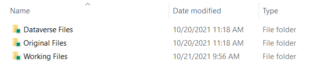
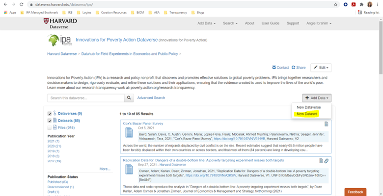
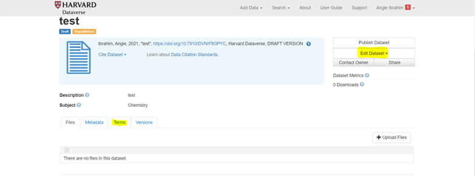
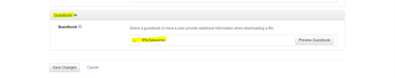
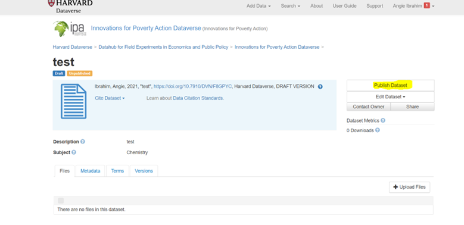

How-to guide

# How to Publish a Replication Package to Dataverse

This how-to guide provides step-by-step instructions for curating research materials and publishing a replication package to IPA’s Dataverse.

------------------------------------------------------------------------

## Authors

- [Niall Keleher](https://poverty-action.org/people/niall-keleher)

## Contributors

- Angie Ibrahim

## Last Modified

- August 25, 2026

## License

- [CC BY-SA](https://creativecommons.org/licenses/by-sa/4.0/)

> **TIP:**
>
> - Set up a curation workspace with separate folders for original files, working files, and final Dataverse files.
> - Remove all personally identifiable information using IPA’s PII detection tools and document your decisions.
> - Verify that all code runs without errors and produces outputs matching published results.
> - Complete a peer review and secondary PII check before uploading to Dataverse.

## Before You Begin

This guide walks you through the data curation workflow for publishing a replication package to [IPA’s Dataverse](https://dataverse.harvard.edu/dataverse/ipa). Before starting, ensure you have:

- Access to the complete research materials (datasets, code, survey instruments)
- Access to the final publication or manuscript for comparison
- Stata installed (or the relevant statistical software used in analysis)
- A Dataverse account with permissions to upload to IPA’s repository

> **NOTE:**
>
> For background on why data sharing matters, see [Understanding Research Transparency](../research-transparency/understanding-transparency.llms.md). For detailed requirements on what materials to include, see [Data Publication Preparation](../research-transparency/publication-preparation.llms.md).

## Step 1: Set Up Your Curation Workspace

Create a folder structure that preserves original files while allowing you to work on modifications.

### Create the Folder Structure

Within your replication folder (named with the study title and primary PI), create three subfolders:

``` text
[Study Name - PI Name]/
├── Original Files/     # Preserve unmodified copies of all received files
├── Working Files/      # Make all modifications here
└── Dataverse Files/    # Final package for publication
```



Folder Structure

The “Working Files” and “Dataverse Files” folders should use the following structure:

``` text
Working Files/
├── data/
│   ├── raw/
│   ├── intermediate/
│   └── final/
├── code/
│   ├── cleaning/
│   ├── analysis/
│   └── figures-tables/
├── documentation/
│   ├── surveys/
│   ├── codebooks/
│   └── readme/
├── output/
│   ├── tables/
│   ├── figures/
│   └── logs/
└── user-commands/
```

### Curation Checklist Overview

Use this checklist to track your progress through the curation workflow:

| Task | Description |
|----|----|
| Set up project folder | Create original files, working files, and Dataverse files folders using the structure above |
| Initial PII checks | Run PII detection tools and document flagged variables |
| Code runs and checks | Verify all code runs without errors |
| Output checks | Compare code outputs against the academic paper or manuscript |
| Secondary PII checks | Run a second PII check after code modifications |
| Status update with PI | Share findings from PII checks and code runs with the research team |
| Write ReadMe | Document the replication package contents and instructions |
| Fill in metadata | Complete the metadata template for Dataverse |
| Create Dataverse entry | Set up the dataset entry with metadata and guestbook |
| Final replication test | Verify successful push-button replication |
| Upload to Dataverse | Double-compress files and upload to the Dataverse entry |
| Update project records | Add Dataverse link to project page and notify communications team |

The following sections walk through each of these tasks in detail.

## Step 2: Remove Personally Identifiable Information

All datasets must be checked for and stripped of personally identifiable information before publication.

> **IMPORTANT:**
>
> For detailed information on identifying PII, including HIPAA guidelines, detection strategies, and anonymization techniques, see [Data Security Protocol: Personally Identifiable Information](../data-security/data-security-protocol.llms.md#personally-identifiable-information-pii).

### Run PII Detection

IPA provides two options for detecting PII:

1.  **PII Detection Tool**: A web-based tool that checks datasets one at a time. Upload each dataset and review the flagged variables. See [PII Detection Tool](https://github.com/PovertyAction/PII_detection) on GitHub for instructions.

2.  **PII Flagging Code**: A Stata do-file that outputs flagged variables to a log file. You can process multiple datasets by listing them in the local macro. See [split_pii](https://github.com/PovertyAction/split_pii) on GitHub for instructions.

### Document Your Decisions

For each flagged variable, record in the curation checklist (PII Checks tab):

- The variable name
- Why it was flagged
- Your decision: keep, drop, or encode
- Justification for your decision

### Apply PII Removal

Based on your decisions:

- **Drop** variables containing PII that are not used in analysis
- **Encode** variables used in analysis that contain identifiable information (anonymize variable and value labels too)
- **Modify specific entries** in free-text fields (`_spec` and `_oth` variables) rather than dropping the entire variable when only some responses contain PII

> **TIP:**
>
> Variables with `_spec` and `_oth` suffixes often contain free-form responses. Review these with care—they may contain PII within participant responses such as names, locations, and contact details. Modify only the entries containing PII rather than dropping the entire variable, as these responses are often informative.

### Check Other Materials

Review all other materials for PII:

- Survey instruments and documentation
- Code comments and file paths
- Variable labels and value labels
- Analysis plans and reports

## Step 3: Verify Code Runs Without Errors

After anonymizing datasets, verify that all analysis code runs through without breaking.

### Set Up the Master Do-File

If one does not exist, create a master do-file that:

1.  Sets relevant globals pointing to appropriate folders
2.  Creates a master log file saved to the logs folder
3.  Documents inputs and outputs for each do-file
4.  Runs all cleaning, shaping, and analysis code in sequence

Example structure:

``` stata
/*******************************************************************************
* Master do-file for [Study Name]
* Runs all code to reproduce paper results
*******************************************************************************/

clear all
set more off
version 17 // Specify Stata version used

* Set working directory - USER MUST UPDATE THIS PATH
global main "INSERT WORKING DIRECTORY HERE"

* Define folder paths
global data     "$main/data"
global code     "$main/code"
global output   "$main/output"

* Start master log
log using "$output/logs/master_log.smcl", replace

* Data preparation
do "$code/01_clean_data.do"
do "$code/02_construct_variables.do"

* Analysis
do "$code/03_main_analysis.do"
do "$code/04_robustness_checks.do"

* Output
do "$code/05_tables.do"
do "$code/06_figures.do"

log close
```

### Run and Fix Code

Run each do-file sequentially, fixing breakage as you encounter it. Common sources of code breakage include:

| Issue | Solution |
|----|----|
| Typos in variable or filenames | Correct the typo |
| User-specific file paths | Replace with globals from master do-file |
| Missing user-written commands | Install required commands (`ssc install [command]`) |
| Variables dropped during anonymization | Remove references or use alternative variables |
| Assert violations from changed variable counts | Update assertions to match anonymized data |
| Version incompatibility | Update syntax for current Stata version |
| Incorrect filenames | Correct the filename references |

### Document Changes

Record all modifications in the curation checklist (Code Runs tab):

- Which do-file required changes
- What the original code was
- What you changed it to
- Why the change was necessary

> **WARNING:**
>
> Be cautious with modifications. Ensure changes do not alter result outputs in ways that create discrepancies between code output and reported results.

## Step 4: Check for Discrepancies

When code runs completely, compare outputs to the published manuscript.

### Compare Results

Check that:

- All tables can be reproduced from the code
- All figures can be reproduced from the code
- Statistical results match what is reported in the paper

### Define Discrepancies

IPA defines a discrepancy as any difference greater than 0.001 between code output and published results.

### Document and Resolve

For each discrepancy:

1.  Record it in the curation checklist (Discrepancy Checks tab)
2.  Flag the discrepancy to the research team
3.  Work with the team to resolve discrepancies where possible
4.  List any unresolved discrepancies in the ReadMe file

## Step 5: Prepare the Final Package

Before uploading, complete final preparation steps.

### Verify ReadMe File

Ensure the ReadMe includes:

- Title and authors
- Citation information
- Software requirements and version numbers
- List of user-written commands
- File structure of the replication package
- Description of each dataset
- Description of each do-file with inputs and outputs
- Any unresolved discrepancies

See [Data Publication Preparation](../research-transparency/publication-preparation.llms.md#readme-file-structure) for a complete ReadMe template.

### Peer Review

Have a second person who did not work on the curation:

1.  Run the complete replication package on their machine
2.  Verify that code runs without errors after updating only the main path
3.  Confirm outputs match the publication

### Secondary PII Check

The peer reviewer should also conduct a secondary PII check to ensure no identifiable information remains in the datasets.

### Prepare Files for Upload

1.  Copy all finalized files from “Working Files” to “Dataverse Files”
2.  Rename the “Dataverse Files” folder to the study title
3.  Compress the folder in ZIP format
4.  Remove the “(2)” from the final filename; filenames should be brief, descriptive, without unnecessary suffixes, and avoid spaces (use underscores, hyphens)

> **NOTE:**
>
> Double compression ensures the folder structure remains intact when users download and unzip the files from Dataverse.

## Step 6: Upload to Dataverse

With your package prepared, upload to IPA’s Dataverse repository.

### Create New Dataset

1.  Log in to [IPA’s Dataverse](https://dataverse.harvard.edu/dataverse/ipa)
2.  Click the “+ Add Data” button on the right side
3.  Select “New Dataset”



Add New Dataset

### Enter Initial Metadata

Fill in the metadata fields using information from the project page and publication:

| Field | Description |
|----|----|
| Title | Publication title, or study name if no publication |
| Authors | All authors with institutional affiliations |
| Description | Paper abstract or summary of intervention, methods, outcomes, and results |
| Keywords | Relevant topic keywords |
| Related Materials | Link to open-access PDF or preprint if available |
| Date of Collection | Data collection period (Start Date - End Date, `YYYY - YYYY` or `YYYY-MM - YYYY-MM`) |
| Country/Location | Countries where data was collected |
| Geographic Coverage | Specific regions, cities, or areas |
| Unit of Analysis | Individual, household, firm, etc. |
| Universe | Population from which participants were drawn |
| Kind of Data | Survey data, administrative data, etc. |
| Data Collection Methodology | How data was collected |
| Data Collector | Organization that collected data |
| Sampling Procedure | How participants were selected |
| Collection Mode | In-person, phone, online, etc. |

### Upload Files

Upload the double-compressed folder when prompted to add files.

### Save and Add Remaining Metadata

1.  Click “Save Dataset” to create the entry
2.  From the entry page, click “Edit Dataset” \> “Metadata”
3.  Complete any remaining metadata fields
4.  Save changes



Save Dataset

### Enable Guestbook

1.  From the entry page, click “Terms”
2.  Select “Edit Terms Requirements”
3.  Scroll to “Guestbook” and select “IPA Dataverse”
4.  Save changes



Edit Terms

### Final Review and Publish

1.  Review all metadata for accuracy
2.  Confirm the guestbook is enabled
3.  Click “Publish Dataset”



Publish Dataset

## Step 7: Post-Publication Tasks

After publishing, complete these follow-up tasks.

### Share the Link

Share the Dataverse entry link with:

- Research team members you corresponded with
- Principal investigators
- IPA Communications team (for potential social media sharing)

### Related Documentation

- [Understanding Research Transparency](../research-transparency/understanding-transparency.llms.md)
- [Data Publication Preparation](../research-transparency/publication-preparation.llms.md)
- [Data Security Protocol](https://data.poverty-action.org/data-security/data-security-protocol.html)
- [IPA’s Dataverse Repository](https://dataverse.harvard.edu/dataverse/ipa)

Back to top
