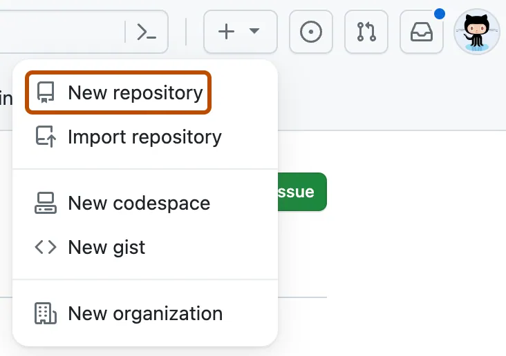
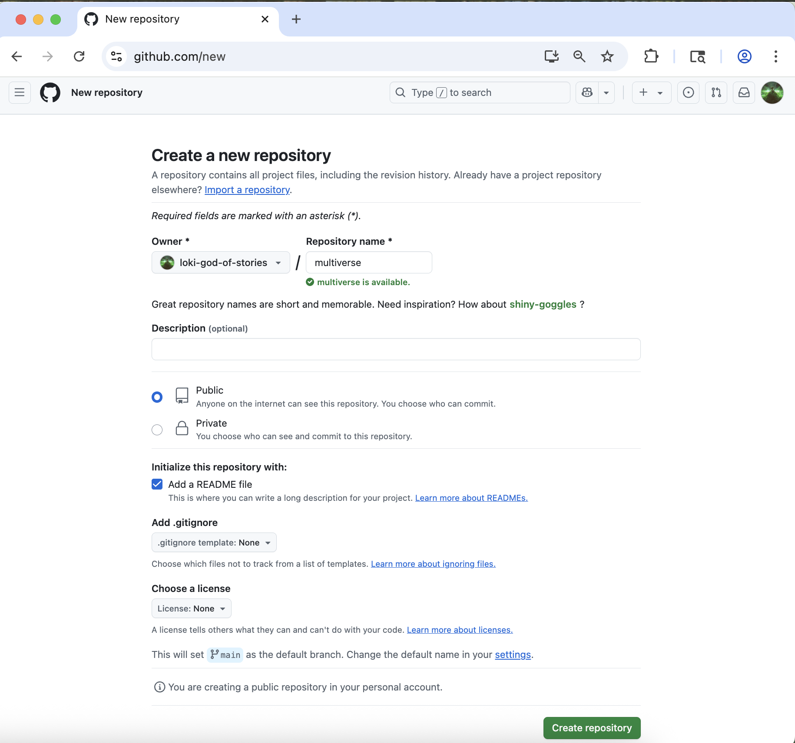
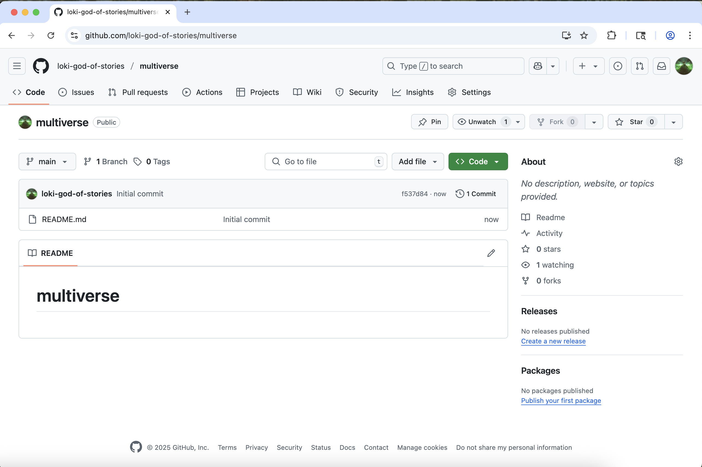
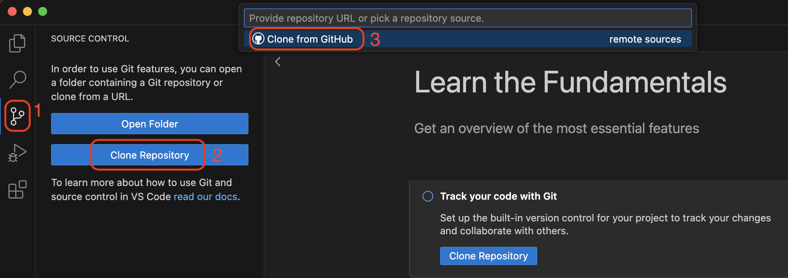
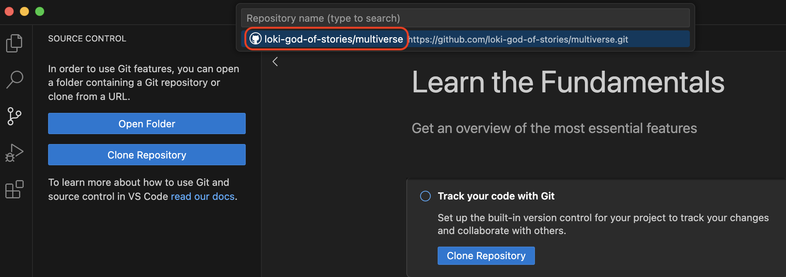

Tutorial

# Create a GitHub Repository

Learn how to create a new repository on GitHub and clone it to your local computer using VS Code, setting up the foundation for version control workflows.

------------------------------------------------------------------------

## Authors

- [Niall Keleher](https://poverty-action.org/people/niall-keleher)

## Last Modified

- September 4, 2026

## License

- [CC BY-SA](https://creativecommons.org/licenses/by-sa/4.0/)

> **NOTE:**
>
> This tutorial modifies content from [Jenna Jordan’s Intro to Git & GitHub (Speedrun edition)](https://jennajordan.me/git-novice-speedrun/), which draws from the [Software Carpentry Version Control with Git lesson](https://swcarpentry.github.io/git-novice/), the [Carpentries Incubator Version Control with Git lesson](https://carpentries-incubator.github.io/git-novice-branch-pr/), and the [Library Carpentry Introduction to Git lesson](https://librarycarpentry.github.io/lc-git/). Copyright (c) [The Carpentries](https://carpentries.org/). The original material is licensed under the [Creative Commons Attribution 4.0 International License (CC BY 4.0)](https://creativecommons.org/licenses/by/4.0/).
>
> **Changes made:** Content has been modified and expanded by Innovations for Poverty Action (IPA) to include IPA-specific examples.

> **NOTE:**
>
> - Create `multiverse` repository on GitHub
> - Clone the `multiverse` repository using VS Code/Positron

## Create a new repo on GitHub

The first thing we need to do is create a new repository. While you can create repositories locally, and never even connect the local repo to a remote repo (hosted on a site like GitHub), the simplest and most common pattern to first create a new repo on GitHub, and then clone that repo to your local computer.

> **TIP:**
>
> The documentation for creating a new repo on GitHub is available in the [GitHub repository creation guide](https://docs.github.com/en/repositories/creating-and-managing-repositories/creating-a-new-repository)
>
> If you have taught this lesson before, make sure that you have deleted your existing `multiverse` repo. The documentation for deleting a repo on GitHub is available in the [GitHub repository deletion guide](https://docs.github.com/en/repositories/creating-and-managing-repositories/deleting-a-repository)

You should already be signed in to GitHub. You can create a new repo from anywhere on the site by clicking on the “+” icon in the upper right, and then clicking “New Repository”:

Create a new repo from anywhere in GitHub

Select your Github username as the “owner”.

Type `multiverse` for the repository name.

Check the box next to “Add a README file”.

Leave all other options as the default - your repo should be public, no gitignore selected, no license selected, and no template selected.

Create the multiverse repo in GitHub

Finally, click the green “Create Repository” button at the bottom right.

You will be redirected to your newly created and empty `multiverse` repo.

Your new multiverse repo on GitHub

> **NOTE:**
>
> Throughout these Git tutorials, you’ll work with two repositories:
>
> 1.  **multiverse**: A repository you create in this tutorial for tracking historical events from South American liberation campaigns
> 2.  **ipa-stata-template**: A repository you cloned in the [Clone a GitHub Repository](../../software/git/clone-repo.llms.md) tutorial for research workflows
>
> Both repositories will be used to demonstrate Git concepts, showing how version control applies to different types of projects.

## Clone your multiverse repo to your local computer

Now that the `multiverse` repo has been created, we can “clone” it (get a local copy of the repo) through VS Code (or Positron).

Make sure you have a new VS Code window open. If you already have a repo/folder open in VS Code (or Positron), go to the “File” menu and click “New window”.

In your new VS Code/Positron window, go to the “Source Control” pane (the 3rd one down). Click “Clone Repository”, and then click “Clone from GitHub”.

Clone a GitHub repo in VS Code

If you don’t immediately see your `multiverse` repo, you can search for it by typing “multiverse” in the search box. When you see your `multiverse` repo (it should have your username in the URL), click it.

Clone your multiverse repo via VS Code

You will now need to choose where on your local computer the `multiverse` repo will live. You can choose any easily accessible location, such as the “Desktop” folder. It is standard practice to save all local repos in a folder named “GitHub” in your “Documents” folder.

Click “Open” when prompted to open the newly cloned `multiverse` repo.

## Open a Bash Terminal in VS Code/Positron

Now that you have your `multiverse` repo cloned and open in VS Code/Positron, the last step is to open a bash terminal.

To see the terminal pane, go to the “Terminal” menu, and click “New terminal”.

If you are on a Windows computer, you will need to specifically open a GitBash terminal. Find the “+” icon in the terminal pane, and click the carrot dropdown icon next to it. Click “GitBash”.

Open a GitBash terminal if on Windows

If you are on a Mac or Linux computer, your default terminal should be sufficient. You can also choose to open a Bash terminal by following the same instructions.

You should now have your empty `multiverse` repo open, with a Bash terminal open, and you are ready to start typing your first git commands!

Ready to begin

## Key Points

- Create a new repository on GitHub
- Clone the repository to your local computer
- Open the terminal in VS Code

Back to top
