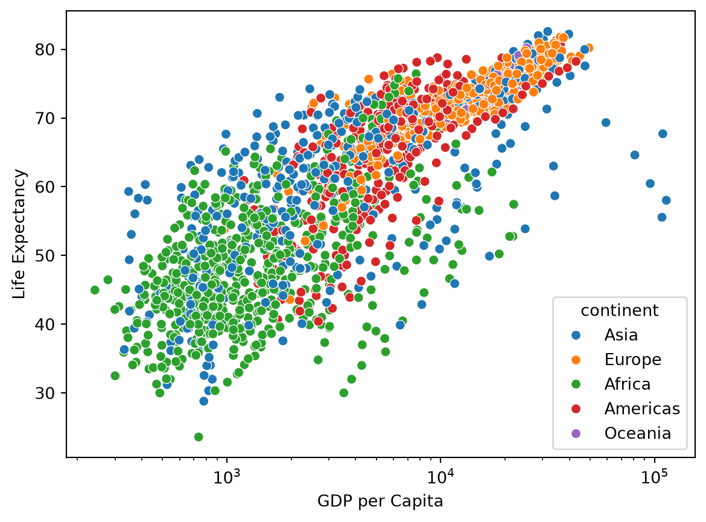
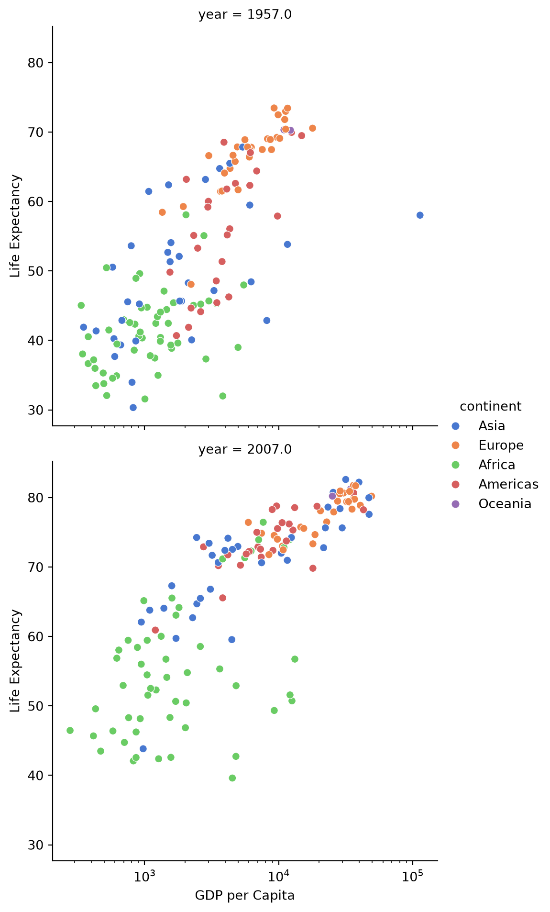

Tutorial

# Python

Getting started with Python for data analysis and research, including installation, setup, troubleshooting, and best practices.

------------------------------------------------------------------------

## Authors

- [Niall Keleher](https://poverty-action.org/people/niall-keleher)

## Last Modified

- September 4, 2026

## License

- [CC BY-SA](https://creativecommons.org/licenses/by-sa/4.0/)

Python is a high-level, general-purpose programming language that is widely used in data science, machine learning, and web development. It has a large standard library and a vibrant community that provides a wide range of libraries and tools for various applications. This guide covers Python installation, package management, environment setup, troubleshooting common issues, and best practices for data analysis and research.

## How to install Python?

There are many ways to install Python. This guide recommends using Python in a virtual environment to avoid conflicts with other Python installations on your system.

The recommended tool is [uv](https://docs.astral.sh/uv), a simple way to create and manage Python virtual environments.

## Installing uv

First, install `uv` using `winget` on Windows or `brew` on MacOS/Linux:

## Windows

``` bash
# Install uv
winget install astral-sh.uv
```

## MacOS

``` bash
# Install uv
brew install uv
```

## Linux

``` bash
# Install uv
brew install uv
```

## Installing Python Packages

You can manage Python packages installed in the virtual environment using a `pyproject.toml` file. See the pyproject.toml example in this repository for an example of how to manage Python packages.

Choose one of the following methods to install packages:

## uv (Recommended)

Add libraries to the virtual environment using `uv add`:

``` python
uv add jupyterlab pandas matplotlib seaborn causaldata
```

This will install:

- **jupyterlab**: Interactive development environment for data science
- **pandas**: Data manipulation and analysis
- **matplotlib**: Plotting and visualization library
- **seaborn**: Statistical data visualization
- **causaldata**: Example datasets for causal inference

## pip

If you prefer pip (Python’s standard package manager):

``` bash
pip install jupyterlab pandas matplotlib seaborn causaldata
```

## conda

If you use Anaconda or Miniconda:

``` bash
conda install jupyterlab pandas matplotlib seaborn
pip install causaldata
```

Note: causaldata is not available in conda channels, so use pip for that package.

## Using Virtual Environments

Using a virtual environment keeps your project packages separate and avoids conflicts. For more guidance, see the [virtual environment guide](../../software/virtualenv/index.llms.md).

## uv

Create and activate a virtual environment with uv:

``` bash
# Create virtual environment
uv venv myproject-env

# Activate it
```

**On Windows:**

``` bash
myproject-env\Scripts\activate
```

**On macOS/Linux:**

``` bash
source myproject-env/bin/activate
```

## venv (Built-in)

Create and activate using Python’s built-in venv:

``` bash
# Create virtual environment
python -m venv myproject-env

# Activate it
```

**On Windows:**

``` bash
myproject-env\Scripts\activate
```

**On macOS/Linux:**

``` bash
source myproject-env/bin/activate
```

For more details on virtual environments, see the [virtual environment guide](../../software/virtualenv/index.llms.md).

## Version Requirements

To ensure compatibility with the examples and tools used throughout this guide, you will need:

- **Python**: 3.8 or higher
- **pandas**: 1.3 or higher
- **seaborn**: 0.12 or higher (required for seaborn.objects interface)
- **matplotlib**: 3.4 or higher
- **numpy**: 1.20 or higher
- **jupyter**: Latest version recommended

The seaborn.objects interface, used in many visualization examples in this guide, requires seaborn version 0.12 or higher. If you encounter errors related to seaborn.objects, make sure you have the correct version installed.

## Verify Your Installation

After installing Python and the required packages, you should verify that everything is working correctly.

### Check Package Versions

Open Python and run the following to check that all packages are installed and verify their versions:

``` python
import pandas as pd
import seaborn as sns
import seaborn.objects as so
import matplotlib.pyplot as plt
import numpy as np

print(f"pandas version: {pd.__version__}")
print(f"seaborn version: {sns.__version__}")
print(f"matplotlib version: {plt.matplotlib.__version__}")
print(f"numpy version: {np.__version__}")
```

You should see version numbers printed without errors.

### Test Seaborn.Objects

Make sure seaborn.objects is available by creating a simple plot:

``` python
import seaborn as sns
import seaborn.objects as so

# Load built-in dataset
penguins = sns.load_dataset("penguins")

# Create a simple plot
(
    so.Plot(penguins, x="bill_length_mm", y="bill_depth_mm")
    .add(so.Dot())
)
```

If this works without errors, the installation is complete.

## Troubleshooting

### Problem: “No module named ‘seaborn.objects’”

Your seaborn version is too old. Update it:

``` bash
pip install --upgrade seaborn
# or
uv pip install --upgrade seaborn
```

### Problem: Plots not showing

**In Jupyter notebooks**: Plots should display automatically.

**In Python scripts**: Add `plt.show()` at the end:

``` python
import matplotlib.pyplot as plt
# ... your plotting code ...
plt.show()
```

Or save the plot to a file:

``` python
plot.save("filename.png")
```

### Problem: Import errors

Make sure you’re using the correct Python environment. Check with:

``` bash
# On Windows
where python

# On macOS/Linux
which python
```

If this shows an unexpected Python installation, make sure the virtual environment is activated.

### Problem: Permission errors during installation

Try installing with the `--user` flag:

``` bash
pip install --user package_name
```

Or use a virtual environment (recommended) to avoid permission issues.

## Setting Up Your Working Environment

Choose one of the following environments for working with Python:

### JupyterLab (Recommended for Beginners)

JupyterLab provides an interactive environment perfect for data analysis:

``` bash
# Start JupyterLab
jupyter lab
```

This will open JupyterLab in your web browser. Create a notebook to start coding.

### VS Code with Python Extension

1.  Install [VS Code](https://code.visualstudio.com/)
2.  Install the Python extension
3.  Create a Python file (`.py`) or Jupyter notebook (`.ipynb`)

VS Code provides excellent support for both scripts and notebooks with features like debugging, linting, and code completion.

### Positron

[Positron](https://github.com/posit-dev/positron) is a new IDE specifically designed for data science:

1.  Download from [positron.posit.co](https://positron.posit.co/)
2.  Install and open
3.  Create a Python file or notebook

Positron combines the best features of traditional IDEs with notebook-style interactive computing.

## Coding Conventions

We highly recommend working with a [virtual environment](../../software/virtualenv/index.llms.md) to manage Python dependencies. The `pyproject.toml` is the preferred way to keep track of python dependencies as well as project-specific python conventions.

We recommend using [Ruff](https://docs.astral.sh/ruff/) to enforce [linting](https://en.wikipedia.org/wiki/Lint_(software)) and formatting rules. In most cases you can use the default linting and formatting rules provided by `ruff`. However, you can customize the rules by modifying the `[tool.ruff]` section of the `pyproject.toml` file in the root of your project. for more about the configuration options, see the [Ruff documentation](https://docs.astral.sh/ruff/configuration/).

If you are working in a virtual environment created in this repository, you automatically have access to `Ruff` through `just lint-py` and `just fmt-python` commands to lint and format your code.

For more inspiration, see the [GitLab Data Team’s Python Guide](https://handbook.gitlab.com/handbook/business-technology/data-team/platform/python-guide/) and [Google’s Python Style Guide](https://google.github.io/styleguide/pyguide.html).

## Example Usage

The example below shows how to use Python to explore and visualize a dataset.

> **IMPORTANT:**
>
> To follow along, you will need to work in a [jupyter notebook](https://jupyter.org/try-jupyter/notebooks/?path=notebooks/Intro.ipynb) with the right libraries installed in your [environment](../../software/virtualenv/index.llms.md). Don’t worry if you cannot do this now; we just want to show you what is possible here. We will revisit this example in [Processing Data in Python](../../software/python/data-processing-python.llms.md).

The following example loads World Bank data from [Gapminder](https://www.gapminder.org/) using the [causaldata](https://github.com/NickCH-K/causaldata) package.

``` python
import pandas as pd
import matplotlib.pyplot as plt
import seaborn as sns
import statsmodels.formula.api as sm
from causaldata import gapminder
```

Load the Gapminder data as a pandas DataFrame:

``` python
df = gapminder.load_pandas().data
```

We can check the dimensions of the DataFrame using `df.info()`:

``` python
df.info()
```

    <class 'pandas.core.frame.DataFrame'>
    RangeIndex: 1704 entries, 0 to 1703
    Data columns (total 6 columns):
     #   Column     Non-Null Count  Dtype  
    ---  ------     --------------  -----  
     0   country    1704 non-null   object 
     1   continent  1704 non-null   object 
     2   year       1704 non-null   int64  
     3   lifeExp    1704 non-null   float64
     4   pop        1704 non-null   int64  
     5   gdpPercap  1704 non-null   float64
    dtypes: float64(2), int64(2), object(2)
    memory usage: 80.0+ KB

Let’s take a look at the first few rows of the DataFrame using `df.head()`:

``` python
df.head()
```

|     | country     | continent | year | lifeExp | pop      | gdpPercap  |
|-----|-------------|-----------|------|---------|----------|------------|
| 0   | Afghanistan | Asia      | 1952 | 28.801  | 8425333  | 779.445314 |
| 1   | Afghanistan | Asia      | 1957 | 30.332  | 9240934  | 820.853030 |
| 2   | Afghanistan | Asia      | 1962 | 31.997  | 10267083 | 853.100710 |
| 3   | Afghanistan | Asia      | 1967 | 34.020  | 11537966 | 836.197138 |
| 4   | Afghanistan | Asia      | 1972 | 36.088  | 13079460 | 739.981106 |

Take a look at the relationship between GDP per Capita and Life Expectancy:

``` python
sns.scatterplot(data=df, x="gdpPercap", y="lifeExp", hue="continent").set(
    xscale="log", ylabel="Life Expectancy", xlabel="GDP per Capita"
)
```



Separate the data by year, focusing on 1957 and 2007:

``` python
sns.relplot(
    data=df.where(df["year"].isin([1957, 2007])),
    x="gdpPercap",
    y="lifeExp",
    col="year",
    hue="continent",
    col_wrap=1,
    kind="scatter",
    palette="muted",
).set(xscale="log", ylabel="Life Expectancy", xlabel="GDP per Capita")
```



## Learning Resources

- [The Python Tutorial](https://docs.python.org/3.12/tutorial/index.html)
- [Python Data Science Handbook](https://jakevdp.github.io/PythonDataScienceHandbook/)
- [Efficient Python for Data Scientists](https://khuyentran1401.github.io/Efficient_Python_tricks_and_tools_for_data_scientists/README.html)
- [The Hitchhiker’s Guide to Python](https://docs.python-guide.org/)

Back to top
