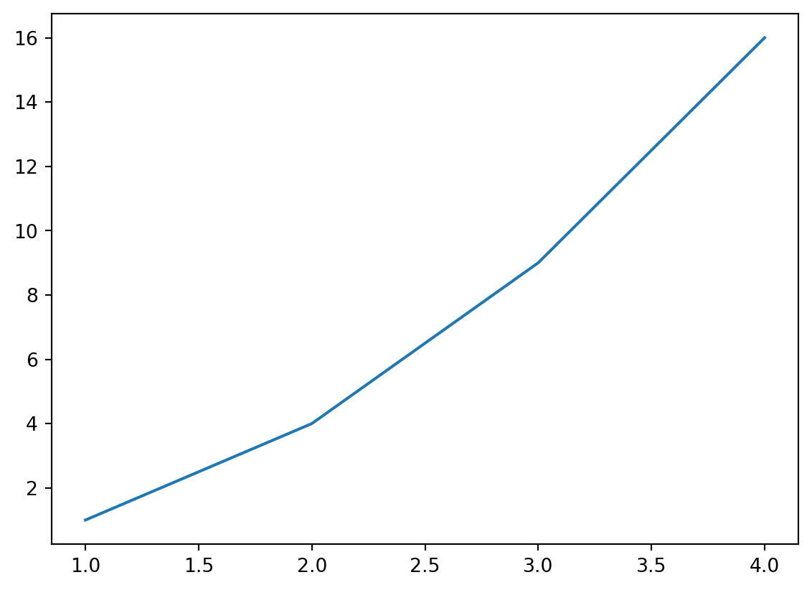

Tutorial

# Writing in Quarto

------------------------------------------------------------------------

## Authors

- [Wamuyu Wanjohi](https://poverty-action.org/people/wamuyu-wanjohi)

## Last Modified

- August 25, 2026

## License

- [CC BY-SA](https://creativecommons.org/licenses/by-sa/4.0/)

Learn the essential Quarto markdown syntax and formatting techniques to create professional, interactive documents for research and data science.

> **TIP:**
>
> - Quarto combines markdown text with code to create dynamic documents
> - Master basic formatting, code blocks, and callouts for effective communication
> - Use interactive features like tabsets and collapsible sections to organize content
> - Apply consistent styling across multiple output formats

## What Makes Quarto Special?

Quarto lets you combine text, code, and visualizations in a single document. Write regular text and seamlessly include code that runs and displays results.

## Text Formatting Essentials

### Basic Text Styling

## Code

``` markdown
*This text is italic*
**This text is bold**
***This text is bold and italic***
~~This text has strikethrough~~
`This is inline code`
```

## Result

*This text is italic* **This text is bold** ***This text is bold and italic*** ~~This text has strikethrough~~ `This is inline code`

### Headers

## Code

``` markdown
# Main Title (H1)
## Section Header (H2)
### Subsection Header (H3)
#### Smaller Header (H4)
```

## Result

Headers create structure and automatic navigation links.

## Lists for Clear Organization

## Code

``` markdown
# Unordered Lists
* Research Design
* Data Collection
  + Phone Surveys
  + In-Person Interviews
* Data Analysis

# Ordered Lists
1. Design your survey
2. Collect pilot data
3. Refine your instrument
4. Launch full data collection
```

## Result

**Unordered Lists** \* Research Design \* Data Collection + Phone Surveys + In-Person Interviews \* Data Analysis

**Ordered Lists** 1. Design your survey 2. Collect pilot data 3. Refine your instrument 4. Launch full data collection

## Code Blocks

## Code

```` markdown
# Simple code display
```
summary(data)
mean(variable)
```

# With syntax highlighting
```python
import pandas as pd
df = pd.read_csv("data.csv")
print(df.head())
```

# Executable code cells

::: {#875a924e .cell execution_count=1}
``` {.python .cell-code}
import matplotlib.pyplot as plt
x = [1, 2, 3, 4]
y = [1, 4, 9, 16]
plt.plot(x, y)
plt.show()
```

::: {.cell-output .cell-output-display}
{width=566 height=411}
:::
:::
````

## Result

**Simple Code Display:**

    summary(data)
    mean(variable)

**With Syntax Highlighting:**

``` python
import pandas as pd
df = pd.read_csv("data.csv")
print(df.head())
```

**Executable cells run code and show output in your document.**

## Callouts

## Code

``` markdown
::: {.callout-note}
This is a standard note callout.
:::

::: {.callout-tip title="Pro Tip"}
Always pilot your survey before deployment!
:::

::: {.callout-warning}
Remember to back up your data.
:::

::: {.callout-important appearance="simple"}
IRB approval required before data collection.
:::

::: {.callout-caution collapse="true"}
## Potential Issues
Click to expand details...
:::
```

## Result

> **NOTE:**
>
> This is a standard note callout.

> **TIP:**
>
> Always pilot your survey before deployment!

> **WARNING:**
>
> Remember to back up your data.

> **IMPORTANT:**
>
> IRB approval required before data collection.

> **CAUTION:**
>
> Click to expand details…

## Tabsets

## Code

``` markdown
::: {.panel-tabset}

## Survey Methods
- Phone surveys
- In-person interviews
- Online questionnaires

## Analysis Tools
- Stata for statistical analysis
- R for data visualization
- Python for machine learning

## Best Practices
- Always clean your data
- Document your methodology
- Version control your code
:::
```

## Result

## Survey Methods

- Phone surveys
- In-person interviews
- Online questionnaires
- WhatsApp surveys

## Analysis Tools

- Stata for statistical analysis
- R for data visualization
- Python for machine learning
- Excel for basic calculations

## Best Practices

- Always clean your data
- Document your methodology
- Version control your code
- Share reproducible results

## Links and Images

## Code

``` markdown
# Links
[Visit IPA's website](https://poverty-action.org)
[Quarto Documentation](https://quarto.org/docs/)

# Images
{width=75%}
```

## Result

**Links:** [Visit IPA’s website](https://poverty-action.org) and [Quarto Documentation](https://quarto.org/docs/)

**Images:** 

## Custom Styling

## Code

``` markdown
::: {.border}
This content has a border around it.
:::

::: {.custom-summary-block}
This matches the site's summary block styling.
:::
```

## Result

This content has a border around it.

This matches the site’s summary block styling.

## Mathematical Expressions

## Code

``` markdown
# Inline math
The formula $E = mc^2$ is famous.

# Block equations
$$
\text{Treatment Effect} = \bar{Y}_{\text{treatment}} - \bar{Y}_{\text{control}}
$$
```

## Result

**Inline math:** The formula \\E = mc^2\\ is famous.

**Block equations:** \\ \text{Treatment Effect} = \bar{Y}\_{\text{treatment}} - \bar{Y}\_{\text{control}} \\

## Tables

## Code

``` markdown
| Survey Type | Response Rate | Cost per Response |
|-------------|---------------|-------------------|
| Phone       | 65%           | $12               |
| In-person   | 85%           | $45               |
| WhatsApp    | 78%           | $3                |
```

## Result

| Survey Type | Response Rate | Cost per Response |
|-------------|---------------|-------------------|
| Phone       | 65%           | \$12              |
| In-person   | 85%           | \$45              |
| WhatsApp    | 78%           | \$3               |

## Next Steps

- **Create Professional Documents:** Combine these elements for research reports and analysis guides
- **Customize Your Style:** Add a `brand.yml` file for consistent styling [Learn more](https://quarto.org/docs/authoring/brand.html)
- **Share Your Work:** Publish to GitHub Pages, Netlify, or other platforms
- **Collaborate:** Use version control with Git to track changes

> **TIP:**
>
> Try creating your own Quarto document using these elements. Start simple with headers, text formatting, and a callout, then add more complex features.

## Learning Resources

### Official Documentation

- **[Quarto Guide](https://quarto.org/docs/guide/)** - Comprehensive documentation covering all features
- **[Authoring Guide](https://quarto.org/docs/authoring/)** - Deep dive into markdown and content creation
- **[Publishing Guide](https://quarto.org/docs/publishing/)** - How to share your documents online

### Interactive Tutorials

- **[Hello, Quarto](https://quarto.org/docs/get-started/hello/vscode.html)** - Quick start tutorial for VS Code
- **[Computations](https://quarto.org/docs/get-started/computations/vscode.html)** - Learn to embed code and outputs
- **[Authoring](https://quarto.org/docs/get-started/authoring/vscode.html)** - Advanced formatting and features

### Examples and Inspiration

- **[Quarto Gallery](https://quarto.org/docs/gallery/)** - Showcase of real-world Quarto projects
- **[Awesome Quarto](https://github.com/mcanouil/awesome-quarto)** - Community-curated list of resources

### Video Resources

- **[Introduction to Quarto](https://youtu.be/_f3latmOhew)** - Overview and key features
- **[Academic Workflows with Quarto](https://youtu.be/EbAAmrB0luA)** - Research-focused examples

### Extensions and Tools

- **[Quarto Extensions](https://quarto.org/docs/extensions/)** - Add functionality with community extensions
- **[VS Code Extension](https://marketplace.visualstudio.com/items?itemName=quarto.quarto)** - Enhanced editing experience

### Community

- **[Quarto Discussions](https://github.com/quarto-dev/quarto-cli/discussions)** - Ask questions and share tips
- **[RStudio Community](https://community.rstudio.com/c/quarto/57)** - Active forum for Quarto users

Back to top
